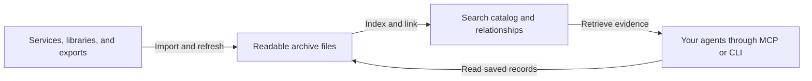

# PPA

PPA (Personal Private Archives) builds a searchable, connected archive of your digital history on your own machine. It brings records from the services you use into one catalog that you control, for you and the agents you choose.

You've already created years of useful history through your conversations, purchases, documents, and plans. Finding something later can depend on remembering where it happened and whether that account still holds the record. When an answer spans several services, you also have to put the pieces together.

PPA imports that history, makes it searchable, and connects records that describe the same people and events. You can return to a conversation with only a rough recollection or reconstruct an earlier decision. Your history remains useful as you change services and agents.

## One history across services

A trip leaves a booking in email, plans in messages, an event on a calendar, and charges in a finance export. A refund may arrive weeks later. No single record tells you what the trip cost or how the plans changed.

An agent can start with the booking, follow relationships across the archive, and reconcile supported charges and refunds. PPA distinguishes booking estimates from actual charges and keeps currencies separate, with arithmetic and source records you can inspect.

Other questions draw on different parts of the same archive:

| You want to know | The archive helps an agent bring together |
| --- | --- |
| What did we agree before the project started? | Meeting transcripts, calendar events, and follow-up conversations |
| Who recommended that place, and what did they say? | A matching message, its surrounding conversation, and the sender's contact record |
| What happened around the time I moved? | Dated conversations, documents, events, and photo metadata |
| Did I cancel that subscription after the price changed? | Imported billing, renewal, and cancellation records in date order |

Connecting an agent to separate services gives it access to each service's search. PPA prepares a shared catalog before the question arrives. The catalog and its relationships carry forward between tasks and agents. You can ask about the event you remember without first deciding which app to search.

## A history you can keep

Your archive lives in Markdown files with structured fields and source references. You can inspect, copy, back up, and move those files. They remain readable outside PPA.

You can keep querying imported records after an account closes or a provider shuts down. Future imports still depend on available source data, but the copy you already hold stays under your control.

As the years add up, you can revisit an earlier part of your life without keeping every old account active. Changing agents does not require importing that history again or trusting one model to remember it for you.

## What goes into the archive

PPA starts with records you've already created. The engine supports service connections, local libraries, and exports, with 36 record types across the following areas:

| Area | Current sources and records |
| --- | --- |
| Conversations and people | Gmail, iMessage, Beeper, Google and Apple Contacts, LinkedIn and Notion people exports |
| Meetings and work | Google Calendar, Otter transcripts, local document libraries, GitHub repositories and activity |
| Money and travel | Copilot finance CSVs; purchases, deliveries, rides, flights, accommodation, and rental cars extracted from supported emails |
| Photos | Apple Photos metadata and labels |
| Health | Apple Health exports and supported clinical record imports, including FHIR, CCD, and Epic EHI |

Email extraction turns supported receipts and confirmations into records with dates, amounts, and identifiers that can be matched across services. Original messages remain available as evidence.

Incremental sources support scheduled refresh, including nightly maintenance. Export imports need new exports to capture later activity. Photos and Health currently use imports without active ongoing refresh. The [specification](archive_docs/SPECIFICATION.md#sources) defines source coverage and update methods.

## Ask through the agents you choose

PPA exposes its archive through the Model Context Protocol (MCP) and a command-line interface. Compatible agents can combine retrieval operations as a question develops:

- Search by exact words, meaning, or a combination of both, with filters for people, dates, sources, and record types.
- Resolve a person across contact identifiers, follow relationships, and read the records behind a match.
- Reconstruct a timeline and retrieve surrounding messages or passages to recover the context of a search result.
- Count or sum eligible records, reconcile trip costs, and inspect the last observed subscription events.

An agent retrieves passages and structured results as it needs them, so years of history do not have to fit into a conversation. PPA retrieves evidence and performs defined calculations; the agent interprets the results and writes the answer.

Analytical results report coverage, completeness, and freshness, so an agent can explain what a total includes. Unresolved identities and inferred relationships remain distinguishable from source facts. The archive describes what was imported, with its gaps still visible.

## How it works

PPA separates the records you own from the indexes used to find them:

| Technology | What it does for the archive |
| --- | --- |
| Markdown and YAML | Keep record content, structured fields, and source provenance in readable files |
| Python and Pydantic | Import source data, normalize records, and validate their structure |
| Rust, Tantivy, and vector indexes | Serve keyword and semantic retrieval across the catalog |
| Postgres and pgvector | Store the derived warehouse and embeddings, and support analytical queries |
| SQLite | Track local changes and cache processing work |

Hybrid search combines keyword rankings with semantic matches from configured embeddings. Chunking makes short exchanges within long threads searchable; neighboring messages preserve their context. Linkers connect records through source identifiers and corroborating evidence, such as contact details and booking codes.

Maintenance processes changed records and reuses compatible embeddings for unchanged text, so refreshes do not need to repeat that processing. A failed index publication leaves the previous index available. Indexes are rebuildable from the archive and its saved correction decisions.

Connector, record, and relationship contracts let developers extend coverage while keeping the same query interface. The [architecture](archive_docs/ARCHITECTURE.md) explains the components and runtime requirements.

## Control over access and processing

You choose what to collect and which clients may query it. Retrieval restrictions apply across search, reads, relationships, and totals. Separate archive instances can keep distinct histories apart.

Storage is local; processing depends on your configuration. Remote embedding and enrichment providers receive the text sent to them, and cloud agents receive the records returned to them. PPA has controls for supported provider requests and retrieval access. Encryption at rest remains the responsibility of the system storing the files. The [specification](archive_docs/SPECIFICATION.md#updates-and-control) describes these boundaries.

## Development

PPA is in development and has not been released for general use. A supported onboarding flow is not available yet.

The [specification](archive_docs/SPECIFICATION.md) defines current capabilities and limits. The [documentation index](archive_docs/README.md) links to technical contracts for people exploring how to build on PPA.
