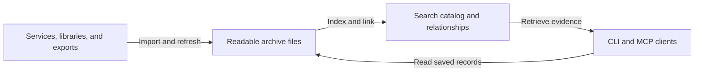

# How PPA works

PPA prepares records across services before an agent asks a question. Imports preserve source content in readable files. Processing gives those records common fields, searchable passages, and relationships that later questions can reuse.

The archive and the search catalog have different jobs. The archive keeps the history you own; the catalog makes it practical to work with that history across providers and years of activity.

## Why the parts are separate

### Keep records independently of their source

Each record is a Markdown file with YAML fields for identity, dates, source references, and relationships. Importers preserve account and provider identifiers so repeated imports can update the same record. The files remain readable when the source account is inaccessible or the owner moves to different software.

Indexes are derived from those records. Recovery needs the files and saved correction decisions before indexes can be rebuilt. That separation lets retrieval improve while preserving an independent copy of someone's history.

### Prepare connections once for later questions

A meeting, its transcript, and its follow-up messages arrive in different formats. Normalization gives them shared fields, while linkers use identifiers and corroborating evidence to propose relationships. Accepted links become available to every client querying the archive.

Source fields, inferred relationships, and corrections remain distinguishable. Models can classify or enrich eligible fields; protected identifiers and amounts follow deterministic rules. An inferred connection does not rewrite what a source established.

### Retrieve the amount of context a question needs

Rust serves live retrieval through keyword, semantic, and hybrid search. Chunking makes short passages within long conversations searchable; neighboring messages help an agent read them in context. Structured queries and analytical workflows can operate on eligible stored records without putting the entire archive into a model's conversation.

The command line and Model Context Protocol (MCP) expose the same archive operations. Clients can search, follow relationships, and read the saved evidence without calling each original provider. Remote agents receive the results returned to them.

### Keep earlier processing useful

Maintenance processes changed records and reuses compatible embeddings for unchanged text. It publishes a complete index before making an update available. A failed publication leaves the previous index available to readers.

Nightly refresh requires a configured schedule and working source access. Each source reports its own freshness, and export imports need a new export to add later activity.

## Technologies

| Technology | Role |
| --- | --- |
| Markdown and YAML | Readable records with structured fields and source provenance |
| Python and Pydantic | Source integration, processing, and record validation |
| Rust and Tantivy | Native indexing and keyword retrieval |
| Embeddings and a trained inverted-file (IVF) vector index | Semantic retrieval across record types |
| Reciprocal rank fusion (RRF) | Combine keyword and semantic rankings for hybrid search |
| Postgres and pgvector | Derived warehouse, embedding storage, and supported analytical queries |
| SQLite | Local change journals and processing caches |
| Model Context Protocol (MCP) | A common archive interface for compatible agents |

The current runtime requires Python 3.10 or newer, the native Rust extension, and Postgres with pgvector. Semantic search requires configured embeddings. Remote embedding or enrichment providers receive the content sent to them under the supported provider controls.

The [specification](SPECIFICATION.md) defines source coverage, query behavior, and privacy limits. The [engine contract](ENGINE_CONTRACT.md) describes the shared types and runtime interfaces used to extend PPA.
