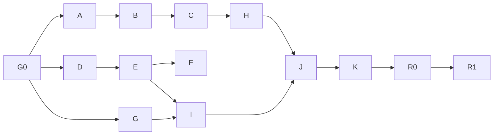

# PR #31 — Close out PR #29/#30 correctness and library-boundary findings

**Status:** implementation-ready after G0; locked product and ownership decisions are below. No implementation or live repair is performed by this document.  
**Target:** one integrated follow-up PR, intended as #31; GitHub assigns the actual number when created.  
**Branch:** `codex/ppa-pr31-correctness-closeout`.  
**Baseline inspected:** `03895dff3c18328759afb0f30c337624574e0776` on `main` at draft time. **G0 reconfirm:** `0ae7cbdb8a52b8e0625d5c84a8e6dc5d3de351d1` — GitHub PR #31 landed the eight person-lookup files (`resolve_person_card` sorted-first). Convert in slice E; not F02/F04 closeout. Latest warehouse migration is `010_processor_receipts.py`; `011` is reserved if slice B needs snapshot-visible completion state.  
**Input:** the user's PR #29/#30 reviews and request to close every finding with long-term maintainability.  
**Framework:** Endaoment Toolbox `/make-plan`, rich destination, vertical slices, explicit dependencies, acceptance/evidence contracts and rollout checkpoints. This is one cohesive plan with internal workstreams, not a requirement for eleven separate PRs. Scale proof (slice K) remains required for this PR.

**Concurrent-work attribution (do this at G0, do not treat as F02/F04 closeout):** the working tree on the inspected baseline contained uncommitted person-lookup edits in these eight files — `archive_cli/__main__.py`, `archive_cli/commands/graph.py`, `archive_cli/index_query.py`, `archive_cli/server.py`, `archive_cli/store.py`, `archive_crate/src/serving_index/metadata.rs`, `archive_crate/src/serving_index/mod.rs`, `archive_tests/test_serving_index.py`. They add richer phone/email person lookup and `resolve_person_card`, which sorts matching UIDs and returns the first. That is a deterministic tie-break, not candidate-set ambiguity. Do not land `resolve_person_card` as uniqueness. Convert it in slice E to `unique|ambiguous|unresolved` candidate sets. Keep the phone/email lookup tests as E fixtures. A finding remains a required regression contract even if later work appears to touch the same symbols.

## Implementation brief

A zero-context agent starts here. The destination and closure matrix below are the authority for _what_ must be true; this brief is the authority for _what not to invent_ and _which existing owners to extend_.

### Destination in six bullets

- Publish only complete, readable evidence bound to an attributable warehouse checkpoint.
- Resolve people without arbitrary or unsafe identity choices; identifier equality yields candidates, not sameness.
- Keep thread membership and conversation proposals current through retries, edits, deletion, and recovery.
- Source cards remain canonical storage. Derived relationships retain method, source revisions, and uncertainty.
- One publication transaction, one identifier-resolution contract, one reversible identity-decision service, one revision-aware thread projection, one real installed CLI/MCP proof path.
- Close F01–F14 with named regressions on isolated fixtures; do not reverse live personal-data decisions during implementation.

### Owner map (extend these; do not grow a parallel stack)

| Concern                   | Existing owner                                                                             | This PR adds / changes                                                                                       |
| ------------------------- | ------------------------------------------------------------------------------------------ | ------------------------------------------------------------------------------------------------------------ |
| Identifier parse/validate | `archive_vault.canon` and `archive_crate/src/canon.rs`                                     | Typed `IdentifierResult`; Python/Rust share one fixture corpus                                               |
| Ingest candidate matching | `archive_vault/identity_resolver.py` (`PersonIndex`, `is_same_person`)                     | Consume typed identifiers; do **not** reimplement here or in the new query service                           |
| Query-time resolution     | _missing_ — native `by_phone` / `resolve_people_filter_uids` and PG SQL each resolve again | New read-only `archive_engine/identity_resolution.py`                                                        |
| Accepted merges / undo    | `archive_engine/corrections.py` `merge_identities()`                                       | Repair CLI calls this; no second write path                                                                  |
| Persisted alias map       | `archive_vault/identity.py`                                                                | Format only; not uniqueness proof                                                                            |
| Publication lifecycle     | `archive_engine/publication.py` (`PublicationReceipt`, `PublisherLease`)                   | Lease moves to cover selection→ack; `ExportReceipt` is an **input** to `publish_snapshot`, not a replacement |
| Warehouse export          | `archive_cli/serving_index.py` `_export_*`                                                 | New `archive_engine/adapters/serving_export.py`; CLI stays a facade                                          |
| Processor dirty/receipts  | `archive_engine/contracts.py` `OutputReceipt`, `archive_sync/processors/scheduler.py`      | Thread dirty scopes reuse these; no new mutation log                                                         |
| Graph evidence            | `EvidenceKind.proposed_link`, `ServingEdge.method`                                         | Conversation proposals use these; consume via linker / `seed_links`                                          |
| CLI kitchen sink          | `archive_cli/commands/identity_repair.py`                                                  | First commit that touches it thins it to dispatch                                                            |

### What not to invent

- A second `is_same_person` / `PersonIndex` inside `identity_resolution.py`.
- A second merge writer beside `corrections.merge_identities()`.
- A replacement for `PublicationReceipt`. Export produces `ExportReceipt`; publication still returns `PublicationReceipt`.
- A new thread dirty queue. Schedule parent scopes through the existing processor scheduler and `OutputReceipt`.
- A second graph writer. Conversation proposals are `proposed_link` edges consumed by existing linker/seed_links.
- A new publisher lease type. `PublisherLease` already exists; it is acquired **too late**.
- Deterministic UID sort as uniqueness. That is the anti-pattern in the uncommitted `resolve_person_card`.
- Suite registration only in `registry.py`. `SUITE_IDS` lives in `archive_tests/acceptance/__init__.py` and must gain `"p31"`.
- A new `--scale-profile` flag. It already exists in `archive_tests/acceptance/run.py` as a reserved passthrough; implement `pr31` behavior.

### G0 checklist

1. `git status --short` and `git rev-parse HEAD`. Attribute the eight concurrent files above; convert or park `resolve_person_card` — do not merge it as F02 fixed.
2. Reserve the next free numbered migration if a PG completion-state column is required; latest in-tree is `010`. Mirror bootstrap DDL.
3. Add `"p31"` to `SUITE_IDS` in `archive_tests/acceptance/__init__.py` (registry builds from that tuple).
4. Create pending `archive_docs/reports/pr31-closeout.md` and `archive_tests/acceptance/data/pr31_cases.json`.
5. Create `logs/plans/pr31/ledger.json` during execution, not during planning.
6. Do not touch the living archive. No cold CLI queries; no `identity-repair --apply`, maintain, rebuild, or publication against a live root.

### Current publication order (do not “add a lease”)

`PublisherLease` already exists. The store-driven path in `publish_serving_index` today is:

1. Read ACTIVE / choose parent
2. Export warehouse (`_export_warehouse_snapshot`)
3. Capture journal (`consume_batch`)
4. Acquire lease inside `publish_snapshot`
5. Build / file-validate / promote
6. Ack captured sequences
7. Truncate **all** DIRTY (`serving_index_truncate_dirty`)

`CHANGE_PUBLICATION_CONTRACT.md` already says DIRTY is not truncated; the code contradicts that. Slice B fixes the code **and** the stale sentence. `publication.py` orchestrates phases; it is not yet one snapshot-bound transaction.

## Destination

PPA must publish only complete, readable evidence for an attributable warehouse checkpoint; resolve people without arbitrary or unsafe identity choices; and keep relationships current through retries, edits, deletion and recovery. The installed CLI/MCP path must prove these guarantees independently of test fixtures' expected answers.

Success is both behavior and structure: one publication transaction, one identifier-resolution contract, one reversible identity-decision service, one revision-aware thread projection, and one real product verification path. Source cards remain canonical storage. Derived relationships retain method, source revisions and uncertainty. Normalization never establishes that two people are the same.

### Grounded problem and closure matrix

| ID  | Observed finding / current implementation                                                                                                         | Required closeout                                                                                               | Owning slice |
| --- | ------------------------------------------------------------------------------------------------------------------------------------------------- | --------------------------------------------------------------------------------------------------------------- | ------------ |
| F01 | `_compatible_name()` accepts any shared token; Alice Smith/Bob Smith with a household phone are proposed for auto-merge                           | Strong positive identity evidence, conflict detection, ambiguous cases queued                                   | F            |
| F02 | Python person lookup and Rust `by_phone` retain a single owner; native metadata is built from unordered map values                                | Candidate sets, explicit ambiguity, stable results across rebuild/order/restart                                 | D, E         |
| F03 | Repair directly writes redirects and aliases instead of calling `merge_identities()`                                                              | Existing reversible service owns all accepted merges, preimages, retries and undo                               | F            |
| F04 | Person-filter resolution scans metadata inside per-card matching                                                                                  | Resolve/compile once per request; indexed lookup and bounded candidate evaluation                               | E            |
| F05 | Child write precedes non-idempotent parent increment; retry cannot repair a lost increment                                                        | Durable dirty scope, revision-aware membership, deterministic rollup through maintenance                        | G            |
| F06 | `alice42` and `bob42` become phone `42`; extensions are appended to phone identity; census equates unchanged digits with E.164                    | Typed validation, opaque handles preserved, explicit region/extension semantics, Python/Rust parity             | D            |
| F07 | Scanner warns and silently omits schema-invalid records                                                                                           | Durable rejection evidence, explicit incomplete coverage, safe publication/last-valid policy                    | H            |
| F08 | `same-conversation` writes a JSON file without a consumer and ignores dry-run                                                                     | Journaled proposals, bounded derived graph consumer, invalidation, actual query proof, read-only preview        | I            |
| F09 | Interrupted vector export returns partial files; missing streamed artifacts can fall back to empty in-memory vectors                              | Fail-closed export receipt, complete checksummed artifacts, no silent fallback                                  | A            |
| F10 | Journal capture follows export; eligible checkpoint is not enforced; all legacy DIRTY is truncated                                                | Snapshot-bound receipt, eligible represented acknowledgements, durable later/gap work                           | B            |
| F11 | ACTIVE selection and export precede publisher lease                                                                                               | One owner from parent selection through promotion/ack; stale-parent rejection                                   | B            |
| F12 | Validation can promote a candidate that the native reader cannot open                                                                             | Full-chain validation/open/canaries before ACTIVE, identical recovery validation                                | C            |
| F13 | Held-out observations partly manufactured; convergence uses MemoryServing and a Python helper as MCP proof; ANN adversary nearly scans everything | Real installed source→PG→native→transport proof, independent relevance oracle, selective scale evidence         | J, K         |
| F14 | Repair/ingest/query paths duplicate policy, write mechanics and lifecycle semantics                                                               | Narrow shared services, versioned adapters, explicit ownership/removal conditions and executable boundary tests | All, K       |

The previous full rebuild and green PR #30 checks are valuable baseline evidence, not proof that these failure paths are fixed. Do not repeat a live full rebuild merely to begin this work. This plan closes the software defects and proves them on isolated data; pre-existing personal-data decisions are not silently reversed.

### Decisions and defaults

| Area                    | Implementation decision                                                                                                                                                                                                                                                                                |
| ----------------------- | ------------------------------------------------------------------------------------------------------------------------------------------------------------------------------------------------------------------------------------------------------------------------------------------------------ |
| Publication ownership   | `archive_engine.publication` coordinates one transaction. The CLI delegates; warehouse export is an injected adapter. The existing `PublisherLease` spans ACTIVE selection, checkpoint capture, export, validation, promotion and acknowledgement — it is not created from scratch                     |
| Delivery                | At-least-once with explicit mutation/revision receipts and idempotent effects; no exactly-once claim across SQLite, files and Postgres                                                                                                                                                                 |
| Warehouse consistency   | Use an explicit repeatable-read read-only transaction. Read the materialization checkpoint/receipt in that same PG snapshot; a later SQLite cursor is not the snapshot's identity                                                                                                                      |
| Canon                   | Extend `archive_vault.canon`; pure parsing/validation produces typed results. Legacy string entry points remain compatibility adapters, not a second normalization policy                                                                                                                              |
| Phone region            | Instance default is explicit NANP/`US` via config (this archive). `+` forms stay international E.164. National numbers without a configured region stay `unknown`, not guessed E.164. Extensions are metadata, never identity digits. Opaque handles (`alice42`) stay opaque. No silent worldwide NANP |
| Email auto-merge        | Exact email auto-merges only when one side is a stub (no given name and no last name) or both are stubs. Two named people sharing an email stay ambiguous                                                                                                                                              |
| Phone auto-merge        | Exact phone requires compatible given/full-name or documented nickname evidence and no conflicting given names. Surname-only overlap, household/shared business phones, and recycled numbers never auto-merge                                                                                          |
| Identity                | Identifier equality yields candidates. Auto-merge requires unique, non-conflicting supported identity evidence; same surname or phone alone is insufficient. No lexical UID tie-break makes an ambiguous identity true                                                                                 |
| Repair writes           | Call the existing correction and journal services. No direct canonical JSON/redirect writes from command orchestration                                                                                                                                                                                 |
| Ambiguous filters       | Exact filters require a unique authorized resolution; ambiguous input returns a structured disambiguation result, not an arbitrary owner. Explicit UID sets provide intentional multi-person queries                                                                                                   |
| Rollups                 | Derived from current child membership/revisions; source message writes durably dirty the relevant parent scopes via existing processor receipts, then a scoped processor converges them                                                                                                                |
| Malformed source policy | Preserve source bytes. Block default promotion when required scan coverage has unresolved rejections. A separately explicit partial-publication request may exclude rejected records with visible incompleteness; never serve the older source revision as current                                     |
| Conversation linkage    | Store a `proposed_link` (`EvidenceKind` already includes this) with evidence/method on `ServingEdge`. Sharing a person does not prove two provider threads are one conversation. Do not merge provider thread identities. Do not add a second graph writer                                             |
| Tests                   | Public-path actions, independent observations, real PG/native and actual MCP transport. Mock/fake tests remain unit tests and cannot count as end-to-end proof                                                                                                                                         |
| Scope                   | One integrated PR with dependency checkpoints and logical commits, including required scale proof in K; live adoption/repair follows a separate reviewable R0/R1 runbook                                                                                                                               |

### Acceptance criteria

- [ ] F01–F14 each have a named regression case, implementation owner, and exact artifact mapping; no finding is closed by a prose claim alone.
- [ ] Interrupted export, missing staged files, malformed vectors, corruption, concurrent publishers and crash/restart cannot activate partial/unreadable evidence or lose pending changes.
- [ ] Full and incremental publication are logically equivalent at the same eligible checkpoint, including deletes, vectors, edges, provenance, rejection/completeness state and identity resolutions.
- [ ] Ambiguous identifiers never silently collapse to one person. Shared household/business phones, conflicting names, duplicate/reassigned identifiers and shuffled load order are tested.
- [ ] Accepted identity decisions survive retry and are reversible through the existing service; source revisions, alias ownership, downstream invalidation and unrelated later edits remain correct.
- [ ] Thread rollups and conversation proposals converge under replay, concurrent child writes, edits, moves, deletion, missing lookup capability, and restart.
- [ ] Unknown person filters do not trigger per-candidate full metadata scans. Resolution work is once per query and scoped caches are invalidated by generation/policy/canon versions.
- [ ] Invalid source coverage is reported through scan, maintain, publication, CLI and MCP. Default release cannot silently call an incomplete archive complete.
- [ ] Installed CLI and actual MCP transport return the expected evidence after real connector/maintenance/publication operations; no fabricated hit IDs or synthetic provenance chain passes as observed output.
- [ ] Selective ANN and pipeline resource evidence are measured on the candidate at realistic dimensions, with reviewed defaults and no omitted failing cohorts.
- [ ] All relevant CI gates pass on the integrated candidate. Inherited sibling artifacts and earlier successful live rebuilds are identified separately.
- [ ] Compatibility adapters have named owners, callers, behavior tests and removal conditions. No new core service imports CLI commands or owns provider-specific parsing.

### Out of scope and negative scope

No new source integrations, LLM identity resolver, open-ended claim engine, warehouse replacement, generic plugin framework, global source-schema rewrite, or gratuitous module renaming. Do not broaden personal-data collection, erase source evidence, auto-undo historical merges, alter the live backup schedule, or reconnect providers. Do not merge solely to reduce `missing_people`; legitimate unresolved/broadcast/system messages remain unresolved.

Do not start cold CLI queries against the living archive. Follow `.cursor/rules/ppa-no-cold-cli-query.mdc`; approved live read checks use the existing warm MCP. Do not kill/restart it for fixture tests. Do not execute `identity-repair --apply`, maintain, rebuild or publication against a live root during implementation verification.

No swallowing export errors, treating a missing staged artifact as an empty corpus, count-only acknowledgement, unbounded graph expansion, arbitrary last-writer alias ownership, raw queue writes, fabricated undo history, test-only alternate production logic, fixture IDs substituted for retrieval output, or changes to hard expectations merely to turn CI green.

## Inputs, ownership and shared contracts

### Required reading for a zero-context implementation agent

Read this whole plan, current repository instructions, `.cursor/rules/ppa-agent-usage.mdc`, `.cursor/rules/ppa-no-cold-cli-query.mdc`, and the relevant existing contracts:

- `archive_docs/CHANGE_PUBLICATION_CONTRACT.md`, `archive_docs/ENGINE_CONTRACT.md`, `archive_docs/PRIVACY_CONTRACT.md`.
- `archive_docs/EVIDENCE_QUERY_CONTRACT.md`, `archive_docs/CONNECTOR_SDK.md`, `archive_docs/RECOVERY_CONTRACT.md`.
- `archive_docs/reports/product-hardening-release.md` and the actual code in `archive_tests/acceptance/scenarios/release.py`; distinguish reported claims from executable proof.
- Existing services: `archive_vault/change_journal.py`, `archive_engine/changes.py`, `archive_engine/publication.py`, `archive_engine/corrections.py`, `archive_vault/identity.py`, `archive_vault/identity_resolver.py`, `archive_sync/processors/scheduler.py`, `archive_cli/linker_modules/communication.py`, `archive_cli/seed_links.py`.

Resolve exact baseline symbols before editing. All paths below are repository-relative. A named **new** file is an implementation deliverable, not a file claimed to exist now. If earlier work relocates a file, integrate that checkpoint and use its published path map; do not recreate the old implementation.

### Library boundaries

| Boundary                                        | Owns                                                                                                                     | Must not own                                                                                            |
| ----------------------------------------------- | ------------------------------------------------------------------------------------------------------------------------ | ------------------------------------------------------------------------------------------------------- |
| `archive_vault.canon`                           | Identifier kind, parsing, validity, canonical value, region/extension metadata and version                               | Alias ownership, merging, I/O, provider calls                                                           |
| Existing `archive_vault/identity_resolver.py`   | Ingest-time `PersonIndex` and `is_same_person` scoring                                                                   | Query-time filter compilation, accepted-merge writes, a second canon                                    |
| New `archive_engine/identity_resolution.py`     | Read-only authorized candidate resolution, ambiguity and merge **proposal evidence**                                     | CLI parsing, source fetches, direct card writes, a reimplementation of `is_same_person` / `PersonIndex` |
| `archive_engine/corrections.py`                 | Accepted decisions, preimages, attribute/alias movement, undo, invalidation                                              | A second repair-specific merge algorithm                                                                |
| New `archive_engine/thread_projection.py`       | Revision-aware memberships and deterministic aggregate inputs                                                            | Provider polling, per-message whole-vault scans, a new dirty-queue format                               |
| `archive_engine/publication.py`                 | Existing `PublisherLease`, snapshot contract, artifact validation/promotion, eligible ack/recovery, `PublicationReceipt` | Raw CLI configuration discovery, duplicated warehouse SQL, replacing itself with `ExportReceipt`        |
| New `archive_engine/adapters/serving_export.py` | PG snapshot-bound export, streaming artifacts and `ExportReceipt`                                                        | ACTIVE mutation or acknowledgement                                                                      |
| Query engine/native metadata                    | Prepared identifier filters and bounded execution                                                                        | Resolving the same user input again for every row                                                       |
| Linker / `seed_links`                           | Materializing `proposed_link` / `ServingEdge` graph evidence                                                             | A second conversation-identity writer                                                                   |
| CLI/MCP                                         | Input validation, request/context construction, transport output                                                         | Merge policy, publication transaction, rollup mutation logic                                            |

The first commit that touches `archive_cli/commands/identity_repair.py` turns its actions into dispatch: `merge` → resolution + `merge_identities()`, `rollup-threads` → `thread_projection`, `same-conversation` → `conversation_links`. That removes the exclusive-file coupling that previously made F, G, and I wait on each other.

Extend existing records rather than parallel near-identical classes. Add versioned records where needed:

- `IdentifierResult`: kind, original value/reference, canonical value or unavailable, validity/reason, region/extension, canon version. No raw sensitive values in general logs.
- `IdentityResolution`: status unique/ambiguous/unresolved, authorized candidate UIDs, supporting identifier kinds/revisions, policy/generation/version fingerprint. No denied-candidate count leakage.
- `MergeProposal`: stable ID, candidate revisions, evidence, conflicts, policy version; applying it revalidates revisions and calls `merge_identities()`.
- `ExportReceipt`: snapshot/checkpoint identity, captured mutation IDs/revisions, exported/rejected sets, artifact counts/bytes/hashes, embedding/canon/schema versions and completeness. `count=0` distinguishes a genuinely empty selection from failure. This is an input to `publish_snapshot`, not a replacement for `PublicationReceipt`.
- `ScanRejection`: UID if recoverable, contained source path, revision hash, safe error code/field names and disposition. Do not log raw validation input values.
- Thread membership/proposal receipts reuse existing `OutputReceipt` and journal identities. Add stable source UID+revision references and an explicit lifecycle status rather than another mutation log. Conversation proposals use existing `EvidenceKind.proposed_link`.

Immutable internal records and versioned serialized forms have one behavioral owner. Required-field/version changes include reader compatibility tests. Old alias maps must not be trusted as proof of uniqueness: rebuild candidate sets from current canonical evidence with explicit legacy status. Preserve old metadata/decision history; migrations are additive and tested against both fresh bootstrap and upgrade.

### Publication transaction details

The existing `PublisherLease` is acquired before ACTIVE/parent selection and remains held until the attempted promotion/ack concludes. Writers may continue; they do not acquire the publisher lease for ordinary source writes. Capture the requested mutation boundary and its pending gaps. Within one explicit PG snapshot, read an eligible materialization checkpoint and the per-revision representation receipts. Bind export to that checkpoint and only acknowledge captured records whose required representations are actually covered. This includes out-of-order sequences and prepared/failed gaps; a high watermark alone is not proof.

Where PG lacks snapshot-visible completion state, add it at the materialization commit boundary using existing consumer/processor receipt mechanisms. Reserve the next free numbered migration at G0; latest in-tree is `010_processor_receipts.py`. Mirror fresh-bootstrap DDL. Publication cannot infer stage completion from wall-clock time, a later SQLite warehouse cursor, or successful traversal of a loop. Required embedding/link work can remain pending; reporting partial stage freshness does not authorize consuming its record as fully served.

Treat canonical journal batches and legacy DIRTY compatibility intake separately. Capture/rotate legacy records using a protocol shared with appenders, preserving writes racing the capture and unconsumed rotated batches after restart. Never truncate the whole live DIRTY file. On promotion-success/ack-failure, retry acknowledges the persisted captured receipt, not a newly read batch. `CHANGE_PUBLICATION_CONTRACT.md` currently claims DIRTY is not truncated; `publish_serving_index` still calls `serving_index_truncate_dirty`. Slice B must make the code match the contract and delete the stale contradiction.

Staging is owned by a run ID under the configured index root. Export uses server-side cursors and bounded binary buffers; file counts and hashes finalize only after successful close/fsync. Invalid dimensions/nonfinite vectors either fail the export or follow an explicit supported exclusion policy whose rejected set is in the receipt; never silently disappear. Missing files or a closed stream error invalidate the entire receipt. Expected zero rows must still produce a validated empty representation. Check resource/disk headroom before export and before promotion, accounting for old generation, staging, native training and retained rollback artifacts.

Candidate validation uses the same native opening logic as serving, addressed by candidate generation rather than by mutating ACTIVE. Validate the entire referenced chain, checksums, version/spec compatibility, tombstones and referential closure; execute bounded native canaries without remote embedding calls. Recovery invokes this same path. Invalid candidates remain inactive; reader pins and the previous generation remain valid. A validation flag on an unverified manifest is not sufficient.

### Identity and relationship semantics

For phone parsing, distinguish valid international E.164, national number requiring explicit region, invalid input and opaque contact handle. The instance default region is NANP/`US` via config. `+` forms are international regardless of default. National numbers without a configured region are `unknown`. Extensions are separate metadata; they do not become base-number digits or independent proof of person identity. Unicode digit and whitespace handling must agree across Python/Rust. Do not drop raw canonical source fields during a read simply because validation becomes stricter. `alice42` / `bob42` remain distinct opaque handles; they must not collapse to digit `42`.

Build multivalued identifier indexes. Candidate generation preserves collisions across names, phone aliases, email, provider/account-scoped handles and redirects. Apply the access context before returning candidates or diagnostics; missing lineage remains unknown/denied as required by the privacy contract. Ambiguous matches do not create deterministic `people` links. Existing unique name/slug/phone queries remain compatible. Explicit UID queries bypass name ambiguity while still applying access policy.

Automatic merge eligibility requires unique, corroborated evidence and no conflicting identity facts. Exact email auto-merges only when one side is a stub (no given name and no last name) or both are stubs; an email shared by two named people is not automatically unique. Exact phone requires compatible given/full-name or documented nickname evidence and no conflicting given names; surname-only overlap does not qualify. Recycled numbers, shared households, shared business mailboxes, multiple candidates, or conflicting later revisions yield reviewable proposals. No arbitrary lexical tie-break makes an ambiguous identity true. Query-time resolution consumes these rules; it does not copy `is_same_person` into a new module.

Repair applies proposals through the existing decision service. That service owns connected-component/cycle checks, idempotent proposal IDs, preimages, alias movement, redirects, downstream receipts, and inverse operations. Preserve historical redirects whose preimages are missing with an honest legacy/non-reconstructible label; do not fabricate a reversible historical decision. No automatic live re-merge/undo is part of implementation.

Thread membership is keyed by source message UID and revision, not phone-handle canon, so slice G does not wait on D or F. Source mutation durably schedules old and new parent scopes for moves; deterministic aggregate work derives counts/time bounds from live membership, not a truncated embedded `messages[]` list. Retry reconciles current state even if the child file already exists. Missing parent/capability leaves durable pending work. Compare timestamps as instants with explicit timezone/unknown handling. A change to the earliest timestamp must be detected even when count and latest timestamp stay constant.

Conversation proposals have stable pair identities, evidence revisions and method (`proposed_link`). Multiple eligible threads must not reduce to `emails[0]`/`phones[0]`; enumerate bounded supported pairs or report ambiguity/truncation. Provider/account boundaries and time evidence constrain proposals. Graph/query output labels the relationship proposed, never established conversation identity. Edits, identity undo and deletions invalidate it through normal receipts. Slice I needs E (ambiguity) and G (thread revisions); it does not need H (scan rejection).

## Verification environment and proof contract

Run commands from the implementation worktree root. Use that worktree's `.venv` and built native wheel. Never borrow a living archive root, shared test DSN, active native handle or another worktree's build artifacts. The acceptance runner provisions unique contained vault/PG/container roots and owns cleanup. Before testing, unset inherited `PPA_PATH`, `PPA_SERVING_INDEX_PATH`, `PPA_INDEX_DSN` and `PPA_TEST_PG_DSN`; use only fixture-configured bindings, hash embeddings or injected test transports. No paid/provider request is needed.

Common verification commands, invoked when relevant to a slice:

```bash
.venv/bin/python -m maturin develop --release --manifest-path archive_crate/Cargo.toml
PYO3_PYTHON="$PWD/.venv/bin/python" cargo test --locked --no-default-features --manifest-path archive_crate/Cargo.toml
.venv/bin/python -m archive_tests.acceptance.run --suite p31 --output logs/plans/pr31 --require-integration
git diff --check
```

G0 registers suite `p31` by adding `"p31"` to `SUITE_IDS` in `archive_tests/acceptance/__init__.py`. Each slice adds its named scenario file below; the final gate requires the entire inventory, while early slice runs execute only their landed cases and explicitly report remaining slices pending. Unit faults may mock an I/O boundary to isolate behavior; end-to-end crash claims require actual child-process termination and restart. Native corruption tests use disposable generations. Never use a real home-directory file as a containment sentinel.

Every evidence record includes scenario ID, guarantee, candidate/base SHA, native artifact hash, config/contract versions, fixture seed/hash, exact command, timings/resource counters, status, artifact hashes and proof tier. Durable transition evidence identifies observed mutation IDs, revisions, checkpoint and generation—not hand-authored example chains. Required skips, empty suites, unknown test availability and inherited artifacts cannot satisfy current-run proof.

## Journey

### Checkpoint G0: fix the baseline and make the regressions executable

- **Delivers:** a clean isolated implementation base, approved scope, owned harness configuration and a complete issue-to-scenario inventory.
- **Owns:** coordinator/verification owner; worktree and ledger, no product repair.
- **Inputs:** this plan; current instructions; `git status`, baseline SHA, current CI/native configuration and existing acceptance harness.
- **Files:** create `archive_docs/reports/pr31-closeout.md` as an explicitly pending report; create `archive_tests/acceptance/data/pr31_cases.json`; add `"p31"` to `SUITE_IDS` in `archive_tests/acceptance/__init__.py` (do not register only in `registry.py` — it iterates that tuple). Create execution ledger `logs/plans/pr31/ledger.json` during execution, not fabricated during planning.
- **Acceptance:** every F01–F14 maps to owner, scenario, assertion and proof tier. The eight concurrent person-lookup files are attributed with the convert-in-E disposition. Migration reservations are recorded only if needed. Fixtures contain no private archive content. All actors use isolated resources.
- **Verification:** `git status --short`; `git rev-parse HEAD`; `git diff --check`; `.venv/bin/python -m archive_tests.acceptance.run --help`; record native build identity using the existing harness helper without opening the live index.
- **Evidence:** baseline/native identity, dependency and shared-file ledger, concurrent-edit disposition, pending case manifest. Zero cases is not a passing product suite.
- **Stop:** unattributed local changes, `resolve_person_card` landed as uniqueness, unavailable required fixture infrastructure, attempted live data use, or baseline drift that invalidates a proposed fix.
- **Blocked by:** approval of this plan for implementation. Drafting this document does not require G0.

### Slice A: interrupted export cannot become a publishable artifact

- **Delivers:** a real fixture export interrupted after several vectors fails visibly and leaves ACTIVE untouched; a successful bounded export produces a complete receipt consumed by publication.
- **Owns:** publication owner; streaming export and staging lifecycle (F09).
- **Inputs:** `_export_embeddings`, `_export_warehouse_snapshot` in `archive_cli/serving_index.py`; `ServingSnapshot`, `_install_snapshot_embeddings` and resource checks in `archive_engine/publication.py`; current streaming test in `archive_tests/test_serving_index_config.py`.
- **Modify:** those modules; `archive_engine/contracts.py` receipt definition; `archive_docs/CHANGE_PUBLICATION_CONTRACT.md`. **Create:** `archive_engine/adapters/serving_export.py`, `archive_tests/test_export_failure_atomicity.py`, `archive_tests/acceptance/scenarios/p31_export.py`.
- **Implementation:** move warehouse export behind the adapter while retaining the existing CLI facade; propagate count/query/cursor/write/flush/fsync failures; finalize checksummed `ExportReceipt` only on success and pass it into `publish_snapshot`. Validate staged file ownership, paired presence, sizes/counts/spec and lifecycle. Missing staged files cannot fall back to empty in-memory data. Clean or quarantine only the run's own staging; preserve resumable/failure diagnostics without plaintext source logs. Keep binary streaming and live-chunk join from PR #29.
- **Acceptance:** interruption after N of M vectors, missing one/both staged files, invalid dimensions, nonfinite values, close failure, zero eligible vectors and simulated disk exhaustion behave explicitly. Invalid export cannot call build/promotion. Successful export uses bounded batches and retains all eligible vector keys exactly once.
- **Verification:** `.venv/bin/python -m pytest -p no:cacheprovider archive_tests/test_export_failure_atomicity.py archive_tests/test_serving_index_config.py`; run the p31 suite with required integration after registering the real-PG export scenario.
- **Evidence:** expected/exported/rejected key sets, receipt hashes/counts, failure injection point and unchanged ACTIVE, batch/allocation counters, staging cleanup ownership.
- **Stop:** caught errors return success, incomplete count is accepted because file lengths agree, memory streaming regresses, or the adapter independently promotes/acks.
- **Blocked by:** G0.

### Slice B: a concurrent mutation is acknowledged only when actually represented

- **Delivers:** two publishers and concurrent source/materialization writes preserve both changes; a snapshot serves only the revisions it can prove and leaves later/failed records pending (F10/F11).
- **Owns:** publication owner; transaction, warehouse checkpoint binding and legacy intake.
- **Inputs:** A receipts; `archive_engine/publication.py`, `archive_engine/changes.py`, `archive_vault/change_journal.py`, `archive_cli/change_consumers.py`, `archive_cli/loader.py`, processor completion receipts; native `dirty.rs` append/capture paths.
- **Modify:** those exact files plus `archive_cli/serving_index.py`, `archive_engine/adapters/serving_export.py`, `archive_crate/src/serving_index/dirty.rs`, `archive_cli/schema_ddl.py` and the G0-reserved migration only if needed. **Create:** `archive_tests/test_publication_snapshot_boundary.py`, `archive_tests/acceptance/scenarios/p31_snapshot.py`; extend `archive_tests/test_publication_concurrency.py` and `test_change_journal.py`.
- **Implementation:** apply the transaction design above. Public `publish()` passes the captured `ExportReceipt` into the adapter; eliminate a second capture in the CLI wrapper. Move the existing lease so it covers selection/export/activation/ack; no stale parent selected before it. Keep warehouse receipt/checkpoint updates atomic with represented PG changes. Persist publication capture for crash recovery. Use exact record coverage and gap tracking, not newest global journal cursor. Replace blanket DIRTY truncation with shared writer-safe capture/replay, and correct the stale “DIRTY is not truncated” sentence in `CHANGE_PUBLICATION_CONTRACT.md`.
- **Acceptance:** pause exporter, write another mutation, resume and prove the later mutation is unacknowledged; commit materialization between export queries and prove one consistent snapshot; run slow/fast publishers with the same original parent and prove no lost delta. Kill after promotion before ack, restart, and acknowledge only the original receipt. Cover out-of-order completion, prepared gaps, embedding-only changes, deletion and legacy appends racing capture.
- **Verification:** rebuild native; `.venv/bin/python -m pytest -p no:cacheprovider archive_tests/test_publication_snapshot_boundary.py archive_tests/test_publication_concurrency.py archive_tests/test_change_journal.py --require-integration`; common Rust command; p31 scenario runner.
- **Evidence:** real process IDs and barriers, snapshot-visible checkpoint, journal/legacy captured-versus-later IDs, full/delta normalized comparisons, ACTIVE ancestry and restart acknowledgement trace.
- **Stop:** snapshot identity read after the transaction, a failed required revision disappears from pending state, two lock owners, new writes lost during DIRTY capture, or lock restructuring creates recursive acquisition/deadlock.
- **Blocked by:** A.

### Slice C: unreadable candidates never replace ACTIVE

- **Delivers:** incomplete/corrupt child or parent artifacts are rejected before promotion; a valid candidate is opened and queried while readers retain the previous generation (F12).
- **Owns:** publication/native owner; candidate validator and recovery reuse.
- **Inputs:** B transaction; `validate_generation`, `recover_publication`; `archive_crate/src/serving_index/{generation,mod,segments,vector}.rs`; existing crash/equivalence tests.
- **Modify:** `archive_engine/publication.py`, the four native files above and `archive_crate/src/serving_index/schema.rs` if a versioned validation manifest extension requires it. **Create:** `archive_tests/test_candidate_activation.py`, `archive_tests/acceptance/scenarios/p31_activation.py`; extend `archive_tests/test_publication_crash_recovery.py`.
- **Implementation:** expose candidate-addressed validation/open sharing serving-reader implementation; no temporary mutation of live ACTIVE to validate. Stream checksums and closure checks; validate every referenced segment, vector/trust/schema/canon version and tombstone effect. Run bounded exact/vector/graph canaries. Write durable COMPLETE only for successful validation, then swap ACTIVE under B's ownership. Recovery revalidates the same artifacts and captured receipt before any action. Preserve reader pins/GC closure.
- **Acceptance:** reproduce the previously accepted incomplete-IVF fixture and now reject it; corrupt checksum, truncate vector data, omit ancestor, use format-1 ancestor, mismatch model spec, corrupt lexical artifact and race reader/GC. All invalid cases retain old ACTIVE and pending work; valid full/delta/empty cases open and query. Validation failure closes resources and leaves no live handle to a rejected candidate.
- **Verification:** rebuild native; `.venv/bin/python -m pytest -p no:cacheprovider archive_tests/test_candidate_activation.py archive_tests/test_publication_crash_recovery.py archive_tests/test_publication_equivalence.py --require-integration`; common Rust command and p31 runner.
- **Evidence:** candidate-open/canary receipts, failed artifact identities, old/new reader generation IDs, bounded memory/resource closure, crash matrix including COMPLETE/promotion/ack.
- **Stop:** existence/count checks substitute for opening, validation implicitly acknowledges, recovery bypasses validation, invalid parent falls back silently, or validating a candidate changes ACTIVE.
- **Blocked by:** B.

### Slice D: identifiers remain distinct unless normalization is valid

- **Delivers:** adapter→card→materializer→native fixture paths agree on valid phone/email/handle forms while opaque or invalid values do not collide (F06, foundation for F02).
- **Owns:** identity owner; pure canon contracts and compatibility adapters.
- **Inputs:** `archive_vault/canon/`, `archive_vault/schema.py`, `archive_vault/identity.py`, `archive_vault/identity_resolver.py` (consume typed results only), `archive_crate/src/canon.rs`, `archive_crate/src/person_index.rs`, `archive_cli/materializer.py`, `archive_crate/src/materializer/text_hash.rs`, existing canon tests.
- **Modify:** those files and `archive_sync/adapters/imessage.py` normalization wrapper only. **Create:** `archive_vault/canon/types.py`, `archive_tests/fixtures/canon/cases.json`, `archive_tests/test_identifier_contract.py`, `archive_tests/acceptance/scenarios/p31_identifiers.py`. Extend `archive_tests/hfa/test_canon.py` and `test_canon_grep_gate.py`.
- **Implementation:** typed kind/validity/region/extension results and version bump with legacy adapter behavior documented. Accept explicit international forms and configured NANP/`US` national forms; mark unsupported regional input `unknown`. Preserve opaque handles and original source data. Parse provider URLs as provider identities, not arbitrary substring extraction from a different host. Canonical source values and generated search aliases remain distinct. Use one shared fixture corpus in Python and Rust with idempotence/equivalence/non-collision assertions. `identity_resolver.py` and later `identity_resolution.py` both import these types; neither grows a private normalizer.
- **Acceptance:** formatted international/NANP equivalents match; `alice42` and `bob42` remain distinct; short digits are not certified E.164; extensions stay separate; non-NANP national numbers without region are unknown. Include Unicode, invalid plus signs, malformed URLs, email plus-tags/dots, empty input, and no inadvertent source-field erasure. Existing unique fixtures remain retrievable.
- **Verification:** rebuild native; `.venv/bin/python -m pytest -p no:cacheprovider archive_tests/test_identifier_contract.py archive_tests/hfa/test_canon.py archive_tests/hfa/test_canon_grep_gate.py`; common Rust command; p31 fixture runner.
- **Evidence:** Python/Rust shared-case results, old/new alias compatibility table, original→typed→indexed mappings, consumer inventory and canon version.
- **Stop:** regex cleanup silently loses source identity, unknown is converted to an exact identifier, a second normalizer is added, or parity is claimed from Python tests only.
- **Blocked by:** G0.

### Slice E: ambiguous people stay ambiguous and filters resolve once

- **Delivers:** shared identifiers give explicit disambiguation while unique name/slug/phone requests return correct cards through native search and typed queries without quadratic work (F02/F04).
- **Owns:** identity/query owner; resolution service, multivalued indexes and prepared filters.
- **Inputs:** D contract; `archive_cli/materializer.py`, `archive_cli/index_query.py`, `archive_vault/identity.py`, `archive_vault/identity_resolver.py`, `archive_engine/query.py`, `archive_engine/adapters/retrieval.py`, native metadata/rank/mod/person-index paths; the G0-attributed `resolve_person_card` / phone-email lookup tests.
- **Modify:** those files and `archive_crate/src/serving_index/{metadata,rank,mod}.rs`, `archive_crate/src/person_index.rs`, `archive_cli/commands/identity_repair.py` only if this commit is the first to thin it to dispatch. **Create:** `archive_engine/identity_resolution.py`, `archive_tests/test_identity_ambiguity.py`, `archive_tests/test_prepared_people_filters.py`, `archive_tests/acceptance/scenarios/p31_people_queries.py`.
- **Implementation:** replace single-owner alias maps with candidate sets and compatibility loading; do not let canonicalize upserts overwrite collisions. Convert `resolve_person_card` from sorted-first to `IdentityResolution`. Handle redirected UIDs consistently. Resolve once under archive/generation/policy/canon context, compile allowed UID sets, then execute membership predicates. Build normalized-name/alias indexes. Remove full-corpus substring fallback from exact identity semantics; optional approximate discovery is bounded and explicitly labeled. Preserve person-self ranking and source/account scopes. Import compatibility rules from `identity_resolver.is_same_person` / shared helpers — do not copy the scorer.
- **Acceptance:** shuffled load order/reopen/full-versus-delta yields identical candidates and statuses; household/shared mailbox/namesake cases never choose a random winner or assert an ambiguous `people` edge. Denied identities do not leak through ambiguity counts. Exact unknown input yields unresolved promptly. Instrumented million-metadata queries perform one resolution per request, no per-row full scans; explicit multi-UID filters remain intentional and stable.
- **Verification:** rebuild native; `.venv/bin/python -m pytest -p no:cacheprovider archive_tests/test_identity_ambiguity.py archive_tests/test_prepared_people_filters.py archive_tests/test_retrieval_privacy.py --require-integration`; common Rust command; p31 runner.
- **Evidence:** candidate-set permutations, exact result UID sets, authorization negatives, resolver invocation/lookup counters, unknown/unique/ambiguous query latency versus corpus size, cache invalidation results.
- **Stop:** deterministic tie-breaking is substituted for ambiguity, old identity-map entries treated as uniqueness proof, hidden candidates affect public diagnostics, or resolver still runs inside per-card matching.
- **Blocked by:** D.

### Slice F: repair merges use one reversible decision service

- **Delivers:** safe duplicate proposals apply through `merge_identities()`, replay as a no-op, survive interruption, and undo without losing later edits; household namesakes remain queued (F01/F03).
- **Owns:** identity owner; proposal eligibility and existing correction-service integration.
- **Inputs:** E resolution; `_compatible_name`, `merge_people`, `canonicalize_people`, existing `merge_identities`/undo and decision logs; `archive_vault/identity.py`, `archive_vault/decisions.py`.
- **Modify:** `archive_cli/commands/identity_repair.py` (thin to dispatch if not already), `archive_engine/identity_resolution.py`, `archive_engine/corrections.py`, `archive_vault/identity.py`, `archive_vault/decisions.py`; extend `archive_docs/RECOVERY_CONTRACT.md`. **Create:** `archive_tests/test_identity_repair_decisions.py`, `archive_tests/acceptance/scenarios/p31_identity_decisions.py`.
- **Implementation:** pure stable proposals plus the locked auto-merge predicates (email stub / phone+compatible given name). Compare full/given/nickname compatibility and conflicting identifiers, not token overlap. Use existing decision service for every accepted write. Apply revision checks, connected-component/cycle validation and deterministic proposal IDs; revalidate stale proposals. Replace raw dedup queue writes with journaled stable records and deduplicated retry. Inspect legacy redirects without inventing preimages or applying fixes to the live archive.
- **Acceptance:** Alice/Bob Smith with one phone never auto-merge; two named people sharing an email stay ambiguous; a named card plus an unnamed email stub with the same exact email may auto-merge; legitimate stub/exact supported duplicate merges preserve attributes and alias ownership. Three-person overlapping candidates do not generate cycles or overwrite decisions. Kill between decision/card/map changes, retry, then undo while preserving unrelated later edits. Re-running repair creates neither duplicate queue rows nor new merge events. Default dry-run changes no canonical, metadata, journal or cache state.
- **Verification:** `.venv/bin/python -m pytest -p no:cacheprovider archive_tests/test_identity_repair_decisions.py archive_tests/hfa/test_identity_repair.py archive_tests/test_identity_decision_undo.py archive_tests/test_manual_corrections.py --require-integration`; p31 runner.
- **Evidence:** proposal/conflict matrix, actual decision IDs/preimages, alias/attribute before-after-undo sets, journal recovery traces, no-op mutation counts, dry-run filesystem fingerprint.
- **Stop:** redirect writes bypass corrections, an ambiguous identity auto-merges, undo requires guessed history, queue I/O bypasses the journal, or preview rebuilds/mutates a cache.
- **Blocked by:** E.

### Slice G: thread rollups converge after child retries and edits

- **Delivers:** child persist→interruption→retry→maintenance produces exact current parent counts/time bounds and queryable revisions, without per-child vault scans (F05).
- **Owns:** thread owner; scoped projection service and scheduler integration.
- **Inputs:** `archive_sync/adapters/imessage.py`, `archive_sync/processors/{declarations,runner,scheduler}.py`, `archive_sync/connectors/replay.py`, journal/`OutputReceipt` paths and existing parent-lookup paths. Membership is keyed by source message UID+revision, so this slice does not wait on identity merge policy.
- **Modify:** those files, `archive_cli/commands/identity_repair.py` (thin to dispatch if this is the first touch; `rollup-threads` becomes a one-liner), `archive_cli/vault_cache.py` scoped lookup port only if needed. **Create:** `archive_engine/thread_projection.py`, `archive_tests/test_thread_projection_recovery.py`, `archive_tests/acceptance/scenarios/p31_thread_projection.py`.
- **Implementation:** retire adapter read-modify-write count bumps. A durable child mutation schedules affected parent scopes through the existing processor scheduler independently of whether a retry finds the file. Track/reconcile live membership via existing warehouse/receipt ownership; updates and parent moves invalidate old/new scopes, deletes remove membership, and source-unavailable parents remain pending. Aggregate by source revisions and parsed instants; update parent through the canonical writer only when derived values change. Batch scoped lookups; never build/load a whole-vault cache for each child. Repair invokes the same projection service.
- **Acceptance:** crash after child write before parent update, two concurrent inserts, duplicate replay, edit/delete/move, earliest-time-only change, timezone offsets, missing parent and missing cache all converge or remain explicitly pending. Repeated successful run changes nothing. Parent values and resulting serving evidence match an independent child-set oracle.
- **Verification:** `.venv/bin/python -m pytest -p no:cacheprovider archive_tests/test_thread_projection_recovery.py archive_tests/archive_sync/test_imessage_adapter.py archive_tests/processors/test_dynamic_outputs.py --require-integration`; p31 runner.
- **Evidence:** child UID/revision membership before/after, pending-scope persistence, processor receipts, parent revisions, restart query results, full-scan/provider-call counters.
- **Stop:** file existence becomes completion evidence, count updates are non-idempotent increments, deletion cannot invalidate, exceptions silently consume work, a new dirty-queue format appears, or recurring full-vault scans are introduced.
- **Blocked by:** G0.

### Slice H: malformed cards produce explicit incomplete coverage

- **Delivers:** an invalid source remains preserved, scan rejection is attributable, default activation is blocked, and explicitly partial results disclose the excluded evidence (F07).
- **Owns:** publication/scanning owner after C; rejection contract and completeness propagation.
- **Inputs:** C validation/receipt; `archive_cli/scanner.py`, `archive_cli/loader.py`, `archive_cli/commands/maintain.py`, EvidenceEnvelope and existing scan/UID-allowlist tests.
- **Modify:** those files, `archive_engine/contracts.py`, `archive_engine/adapters/serving_export.py`, `archive_engine/publication.py`, `archive_cli/commands/confidence.py`, `archive_cli/server.py` serialization only. **Create:** `archive_tests/test_rebuild_rejection_coverage.py`, `archive_tests/acceptance/scenarios/p31_rejections.py`.
- **Implementation:** return structured rows plus rejections from every scanner path, including native/cache/worker paths. Persist source revision and safe reason/field codes, not raw Pydantic input dumps. Bind rejected set to ExportReceipt and stage coverage. Keep prior generation for rollback; default promotion fails on unresolved required coverage. An explicit partial request excludes rejected source revisions, reports incomplete coverage and leaves required work pending. Missing-from-scan does not become source deletion. Repairing a card clears its rejection only after successful reprocessing.
- **Acceptance:** valid→invalid→repaired source sequence behaves consistently for full/incremental scans. Source file remains intact; old revision is never labeled current; default ACTIVE unchanged on rejection. Partial mode visibly reports excluded scope through CLI/MCP without leaking denied paths; repaired records return and pending state clears. Logs exclude sensitive raw values.
- **Verification:** `.venv/bin/python -m pytest -p no:cacheprovider archive_tests/test_rebuild_rejection_coverage.py archive_tests/test_rebuild_uid_allowlist.py archive_tests/test_confidence.py --require-integration`; p31 runner.
- **Evidence:** accepted/rejected/excluded UID sets, source hashes, default/partial/repaired activation matrix, CLI/MCP coverage payloads and negative log scans.
- **Stop:** rejected rows vanish from accounting, prior values are silently served as current, a parse failure implies a canonical tombstone, or partial mode automatically acknowledges unresolved work.
- **Blocked by:** C.

### Slice I: same-conversation proposals are durable, queryable and invalidatable

- **Delivers:** preview writes nothing; applied supported proposals materialize through normal maintenance into labeled graph evidence and retire when supporting identity/thread revisions change (F08).
- **Owns:** thread/identity owner; relationship proposal service and consumer.
- **Inputs:** E identity resolution (ambiguity), G projections (thread revisions), existing `emit_same_conversation_edges`, `archive_cli/seed_links.py`, `archive_cli/linker_modules/communication.py`, native graph evidence contract. Scan rejection (H) is not a semantic dependency.
- **Modify:** `archive_cli/commands/identity_repair.py` (thin to dispatch if not already), `archive_cli/__main__.py` apply/help wiring only, `archive_cli/linker_modules/communication.py`, `archive_sync/processors/declarations.py`, `archive_sync/processors/runner.py`, `archive_cli/seed_links.py` receipt integration only. **Create:** `archive_engine/conversation_links.py`, `archive_tests/test_conversation_proposal_lifecycle.py`, `archive_tests/acceptance/scenarios/p31_conversation_links.py`.
- **Implementation:** stable unordered pair IDs scoped to archive/provider/account, proposal method and required source revisions; deterministic bounded enumeration with explicit uncertainty. Persist through canonical journal/decision machinery and consume with existing linker/materialization services as `evidence_kind=proposed_link` / `ServingEdge.method`. Do not add a second graph writer. Legacy `_meta/same-conversation.json` imports idempotently as legacy proposals requiring revalidation, not trusted graph facts. Recompute only impacted scopes; retire invalid proposals after identity undo, source edit or deletion. CLI delegates and honors `--apply` for this action.
- **Acceptance:** no files/cache/journal change on preview; apply/retry creates one proposal/edge per supported pair; multiple threads yield all bounded supported pairs or explicit truncation, never first-element selection. Ambiguous/shared-phone people create no deterministic edges. Graph response contains method/evidence and proposed status; edit/delete/undo removes obsolete live edges. Account/policy restrictions apply to support and results.
- **Verification:** `.venv/bin/python -m pytest -p no:cacheprovider archive_tests/test_conversation_proposal_lifecycle.py archive_tests/test_phase_6_5_linkers.py archive_tests/test_retrieval_privacy.py --require-integration`; p31 runner.
- **Evidence:** preview fingerprint, journal/consumer receipts, exact proposal/edge identities, graph CLI/MCP payloads, edit/delete/undo invalidation chain and legacy migration replay.
- **Stop:** proposals remain an unconsumed JSON file, shared person is presented as proved conversation identity, dry-run mutates state, lineage/policy is omitted, or a parallel edge writer appears beside linker/seed_links.
- **Blocked by:** E, G.

### Slice J: replace proof shortcuts with the installed product path

- **Delivers:** actual installed connector→canonical→PG→native→CLI/MCP behavior proves the review findings fixed; breaking retrieval/transport/publication makes the corresponding gate fail (F13).
- **Owns:** verification owner; shared oracle, installed harness and real release scenarios. Feature owners fix production regressions.
- **Inputs:** all preceding receipts; `archive_tests/acceptance/scenarios/{release,p06_convergence}.py`, `archive_tests/acceptance/{environment,registry,corpus,oracle,release_manifest}.py`, `archive_tests/acceptance/p09_install_support.py`, `archive_scripts/build_release.py` and wrapper `build-release.py`.
- **Modify:** those files and `archive_tests/test_release_manifest.py`; update `archive_tests/acceptance/data/pr31_cases.json`. **Create:** `archive_tests/acceptance/scenarios/p31_end_to_end.py`, `archive_tests/test_pr31_release_contract.py`, `archive_tests/acceptance/data/pr31_quality_queries.json`.
- **Implementation:** build candidate wheels, verify SHA/hashes and install outside checkout in a fresh environment. Start one owned fixture MCP process using the supported transport, perform initialization and actual tool calls; do not label a Python command helper MCP. Persist synthetic connector events, invoke real maintain, query native serving, then edit/delete/undo and repeat through the same configured runtime. Observe generation/revision/citation chain from actual responses. Remove fixture-derived `observed` sets, MemoryServing proof substitutions and hardcoded success relation maps. Keep such helpers only in explicitly labeled unit tests. Reuse the installed helper without stale artifact fallback.
- **Acceptance:** all F01–F14 cases execute their real relevant public path. Suppressed/denied hits fail if the engine returns them; empty/broken search cannot pass by fixture membership. Connector burst/thread freshness reaches current evidence in installed transport after restart. Missing child scenario, missing assertions, hash mismatch, required skip or stale generation fails. Frozen held-out labels remain independent from returned results.
- **Verification:** `.venv/bin/python archive_scripts/build-release.py --output logs/plans/pr31/release`; `.venv/bin/python -m pytest -p no:cacheprovider archive_tests/test_pr31_release_contract.py archive_tests/test_release_manifest.py --require-integration`; run `--suite p31` and `--suite release` with distinct output directories and required integration. Rebuild artifacts after any production repair.
- **Evidence:** native/wheel/source identity, real MCP protocol transcript, event→receipt→generation→source-citation observations, all case results and deliberate regression negative controls. Synthetic artifacts only.
- **Stop:** gate reads expected IDs instead of issuing queries, installed proof inherits source-tree imports, arbitrary helper is called MCP, unavailable infrastructure skips green, or current candidate proof uses inherited sibling binaries.
- **Blocked by:** H, I.

### Slice K: prove selective retrieval, scale bounds and maintainable release closure

- **Delivers:** a single integrated candidate passes correctness, meaningful performance/quality evaluation, architecture guards and CI; every finding has an auditable closure disposition.
- **Owns:** verification/coordinator owner with native/publication/identity owners supplying metrics and repairs (F13/F14).
- **Inputs:** J installed candidate; `archive_tests/acceptance/ann_corpus.py`, `archive_tests/acceptance/scenarios/p01_ann.py`, `archive_cli/serving_scale.py`, existing engine-boundary tests and `.github/workflows/{test,rust,product-release}.yml`.
- **Modify:** those files; implement `--scale-profile pr31` behavior on the existing reserved flag in `archive_tests/acceptance/run.py` (do not add a second flag); `archive_tests/test_engine_boundaries.py`; `archive_docs/reports/pr31-closeout.md` and existing engine/publication/query/connector/recovery contracts. **Create:** `archive_tests/acceptance/scenarios/p31_scale.py`, `archive_tests/test_pr31_architecture.py`.
- **Implementation:** frozen calibration/held-out cohorts for exact identity, ambiguity, phone forms, unknown names, long replies, history/current-ops, suppression, same-charge/trip and lifecycle. ANN oracle compares the full exact top-k eligible set, not only a planted neighbor. Require selective profiles at 10k/100k vectors and production dimension 1536; record candidate fraction and bound it at no more than 10% on those unconstrained benchmark cohorts, while preserving the correctness oracle and allowing documented bounded exact search for tiny filtered sets. These are explicit anti-near-full-scan benchmark constraints; do not quietly change them to 1088/1089. Measure Recall@k, ranking quality, evidence coverage, exclusions, latency and memory. No invented 0.95/0.90 recall promise; reviewer selects defaults from measured tradeoffs and rejects unresolved material regression.
- **Acceptance:** all F01–F14 regression cases pass on the integrated installed candidate; required CI, selective-retrieval, scale and architecture checks below pass with attributable artifacts and a recorded quality verdict. Missing proof blocks closeout.
- **Scale acceptance:** instrument unknown-name queries on million-card synthetic metadata and demonstrate one resolution with bounded/indexed work. Exercise export→train→validate→open at a capacity profile representative of the observed 4.35M×1536 corpus when declared resources permit; resource preflight must fail before expensive work when they do not. Include Python-side metadata, native allocations, staging/rollback disk and cache load—not just float32 vector bytes. Missing required scale resources mark scale closure blocked, not implementation fully proven; obtain an adequate isolated runner rather than silently substituting live production. Capture output completeness with controlled interruption as well as success.
- **Architecture acceptance:** dependency tests prohibit CLI-owned identity/publication/rollup algorithms, duplicate normalizers and direct repair writes. Existing facade adapters delegate to one implementation; list actual callers, tests and removal conditions. `identity_resolution.py` must not import or clone `PersonIndex`. `conversation_links.py` must not write graph artifacts except through linker/seed_links. `serving_export.py` must not promote or ack. No required gate is bypassed. If holdout failures inform tuning, retain them as regressions and version a fresh holdout before claiming independent generalization.
- **Verification:** `.venv/bin/python -m pytest -p no:cacheprovider archive_tests/test_pr31_architecture.py archive_tests/test_engine_boundaries.py`; `.venv/bin/python -m archive_tests.acceptance.run --suite p31 --scale-profile pr31 --output logs/plans/pr31/scale --require-integration`; `.venv/bin/python -m archive_tests.acceptance.run --suite release --output logs/plans/pr31/release-proof --require-integration`; `.venv/bin/python -m pytest -p no:cacheprovider archive_tests/ -m 'not integration and not slow'`; integration CI uses its isolated owned DB job; common Rust command; `.venv/bin/python -m ruff check .`; `.venv/bin/python -m ruff format --check .`; `git diff --check`.
- **Evidence:** case→assertion→artifact closure table for F01–F14, baseline/candidate quality matrix, candidate fractions, resource graphs/counters, CI URLs, installed artifact manifest, dependency graph, remaining adapters and reviewed quality verdict. Report synthetic scale, installed integration and live adoption separately.
- **Stop:** required proof unavailable, gate softened, near-full-scan ANN represented as selective proof, material cohort regression unexplained, old publication/repair path still callable, or any finding is marked fixed without its reproducer passing.
- **Blocked by:** J.

## Sequencing, integration and commit discipline

| Checkpoint | Hard prerequisites               | Lane                     |
| ---------- | -------------------------------- | ------------------------ |
| G0         | Plan approval for implementation | Coordinator              |
| A          | G0                               | Publication              |
| B          | A                                | Publication              |
| C          | B                                | Publication/native       |
| H          | C                                | Scan/publication         |
| D          | G0                               | Identity                 |
| E          | D                                | Identity/native query    |
| F          | E                                | Identity decisions       |
| G          | G0                               | Thread projections       |
| I          | E, G                             | Conversation integration |
| J          | H, I                             | Installed verification   |
| K          | J                                | Scale/CI/closeout        |

Three useful implementation lanes run concurrently: **A→B→C→H**, **D→E→F**, and **G**, then **I→J→K** join them. G does not wait on F: thread recount is not merge policy. I does not wait on H: conversation proposals need ambiguity and thread revisions, not scan rejection. J waits for both H and I so publication completeness and conversation evidence are on the installed path. K stays required, including selective ANN and the declared scale profile; missing isolated scale resources still block K and are not waived. Verification can prepare isolated fixtures and oracle data in parallel without changing shared runner behavior until the owned checkpoint. This is permission structure for future implementation, not a request to spawn agents during planning.



Use one integrated PR with a logical commit group per vertical slice. Each commit group includes its tests and contract deltas; no giant final test-only commit. Slice owners integrate predecessor SHAs before touching shared adapters. The coordinator records owner/base/ready/running/blocked/review/integrated states, actual shared files and evidence in the ledger.

Exclusive shared-file handoffs apply to `archive_engine/contracts.py`, `archive_cli/serving_index.py`, native `mod.rs`/`metadata.rs`, and processor declaration/runner files. `identity_repair.py` is not an exclusive lock: the first touch thins it to dispatch, after which later slices only change their one-liner. The later owner integrates the earlier adapter patch before editing. New service/fixture work may continue independently. Locks here mean coordinator ownership, not new application infrastructure. Do not solve collisions by keeping two implementations. Numbered migrations are reserved centrally and bootstrap parity is mandatory.

## Completion, compatibility and rollout

PR implementation closeout requires K, all finding reproductions fixed and all required proof present. The merge description must lead with actual corrected behaviors and cite final candidate artifacts, rather than copying plan completion labels. Post-fix evidence supersedes inaccurate earlier release claims with a clear correction; it does not rewrite historical artifacts to appear stronger than they were.

Migration compatibility must be tested with existing format-2 generation metadata, string alias maps, old canon version, legacy dedup/same-conversation JSON and existing redirect history. Existing live records are not rewritten merely by installing the new reader. Document which operations rebuild derived indexes versus alter canonical decisions. Preserve readable rollback artifacts and executable/version pairings; do not promise an old binary can read a new durable format without a test.

### Checkpoint R0: review the concrete live-adoption proposal

- **Delivers:** a bounded plan for adopting the tested executable and, only if needed, repairing existing derived/identity state.
- **Owns:** coordinator and archive owner.
- **Inputs:** K proof, current actual instance configuration/active generation, correction inventory obtained through authorized read-only means, backup/restore capability.
- **Files:** create `archive_docs/runbooks/pr31-adoption.md` with exact instance-specific commands, expected affected counts, resource headroom, retained generations, backup/checkpoint and rollback executable. Keep personal evidence private.
- **Acceptance:** code deployment, index migration and canonical identity decisions are separately identified. Existing ambiguous/historical decisions are review items, not automatic inverse writes. No new full live rebuild is assumed necessary. Required live warm-query checks and maintenance pause/resume boundaries are explicit.
- **Verification:** `git diff --check`; verify referenced backup/checkpoint artifacts and installed candidate identity without cold-opening the living archive; review dry-run scope and rollback commands.
- **Evidence:** owner-reviewed adoption scope, concrete commands, expected outcomes and recoverability limits.
- **Stop:** implementation proof incomplete, backup unavailable, impact unknown, or rollback requires fabricated history.
- **Blocked by:** K and explicit approval of the concrete live-adoption scope. PR completion alone is not live mutation authorization.

### Checkpoint R1: apply only approved adoption and record live proof

- **Delivers:** the approved bounded adoption produces expected live behavior and retains rollback capability.
- **Owns:** operator under R0 scope.
- **Inputs:** R0 runbook and approved commands only.
- **Files:** only artifacts/data/config explicitly named in R0; append redacted outcome to `archive_docs/reports/pr31-closeout.md`.
- **Acceptance:** expected mutation/checkpoint/generation transitions match; existing warm MCP returns the approved identity/context canaries; later/no-op maintenance is honest; no unapproved merges or broad repair.
- **Verification:** run R0's exact commands, compare before/after receipts and warm MCP outputs, and use its rollback procedure on any failed stop condition. No generic guessed live command is authorized by this draft.
- **Evidence:** actual deployed SHA, generation/checkpoint, authorized query results, resource/maintenance observations and rollback retention.
- **Stop:** candidate activation fails, unexpected affected scope, pending work lost, incorrect identity merge, privacy regression or resource ceiling exceeded; stop further mutation and follow R0 recovery.
- **Blocked by:** R0.

## Resolved assumptions and remaining engineering decisions

| Item                                                 | Disposition / owner                                                                                                                                                                            |
| ---------------------------------------------------- | ---------------------------------------------------------------------------------------------------------------------------------------------------------------------------------------------- |
| One follow-up PR including scale                     | User requested; target #31 is a label, not a guaranteed GitHub allocation. K remains required                                                                                                  |
| Existing services instead of new parallel frameworks | Required; see owner map and “what not to invent”                                                                                                                                               |
| Concurrent `resolve_person_card`                     | Convert in E to candidate sets; do not land as uniqueness. Coordinator attributes the eight files at G0                                                                                        |
| Alias/decision/journal migration numbers             | Coordinator reserves next free number at G0; latest in-tree is `010`; existing history retained                                                                                                |
| Phone-region configuration                           | Locked: instance default NANP/`US` via config; `+` stays international; unsupported national input stays unknown; extensions are metadata; opaque handles stay opaque                          |
| Email / phone auto-merge predicates                  | Locked: email auto-merge only for stub↔named or stub↔stub; two named people sharing email stay ambiguous; phone auto-merge needs compatible given/full/nickname and no conflicting given names |
| Query vs ingest identity                             | `identity_resolution.py` is read-only; ingest keeps `identity_resolver.py`; both share typed canon; `corrections.py` is the only accepted-merge writer                                         |
| Receipt / evidence reuse                             | `ExportReceipt` feeds `publish_snapshot`; thread dirty uses `OutputReceipt`; conversation uses `proposed_link`                                                                                 |
| Historical invalid merges                            | No automated live undo; actual preimages and owner intent determine R0 scope                                                                                                                   |
| Resource envelope and benchmark defaults             | Owners measure; inability to run required isolated scale remains an explicit blocker, not waived proof                                                                                         |
| Review of defaults/quality                           | Reviewer records accept/retain optional baseline/needs revision against K's measured cohorts; verification code cannot fabricate acceptance                                                    |
| Production mutation                                  | Deferred to concrete R0/R1 authorization; planning and implementation fixtures do not grant it                                                                                                 |

The sufficiency gate passes for a rich plan: destination and acceptance are derived from the reviews; paths/services are grounded in the inspected baseline; remaining product predicates are locked; reversible migration and live boundaries are explicit; owners and commands are named. No implementation agent should need the original conversation to understand what to build, how to verify it, or when to stop.
