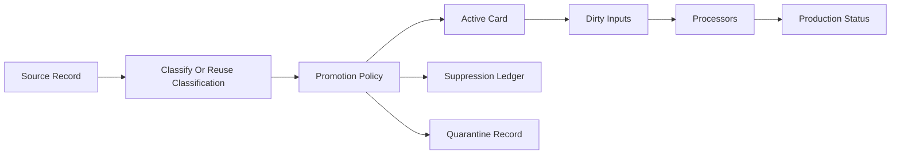
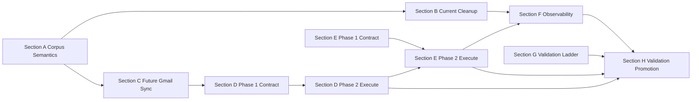

# PPA v2.5 Vision - Local Seed Living Archive

---

## The Core Thesis

v2 is closed. Phase 9 proved a one-person PPA can exist. v2.5 is the production-hardening release between v2 and v3. It does not make PPA installable by strangers. It does not introduce Docker packaging, a setup wizard, encryption UX, contribution workflows, or native-app surface area.

**v2.5-done is a local seed living archive, not Arnold promotion.** The canonical corpus on this machine is `/Users/rheeger/Archive/seed/hf-archives-seed-20260307-235127` (schema `ppa`). Arnold is **down** and is **not** the intended long-term home. Some updaters need this Mac (or later Helga Pataki) — iMessage snapshots, Photos (parked), local Beeper, GitHub `gh`, Otter MCP, Google tokens. The ops model is: **run updaters where the secrets and devices live; the corpus lives here.**

The core problem is that v2 proved the archive can exist. v2.5 proves this seed can stay healthy as the main corpus.

Two things define that shift:

1. **Corpus quality:** marketing and bulk email should not occupy the same active archive surface as personal correspondence, transactions, calendar-bearing threads, and typed artifacts. Gmail can remain the source of record for bulk mail; PPA should be the high-signal active corpus.

2. **Freshness:** each source must have a clear updater contract, cursor, dirty-set model, and downstream processor invalidation path. Extractors, enrichment, embeddings, and linkers must be able to refresh from changed inputs without treating the archive as a frozen March snapshot.

3. **Ops locality:** written H once said fixtures → slices → seed staging copy → Arnold. That sequence was **skipped**. Do not copy the seed first. Do not deploy Arnold to close v2.5. Formal `ready: false` leftover from missing `validation_gates` / `corpus_cleanup` review rows is an accepted local exception (`local_seed_living_corpus`) — do not restage a fake ladder to satisfy the enum.

Planning docs and implementation for Sections A–G are landed on branch `v2.5`, including D/E Phase 2, the A/B/C merge (`5737db3`), the **scale hot-path commits** (`0c53d7e`…`3a90bc0`), the **2026-08-26–28 local-seed campaign** (`b57136f`), and the **local close-out** (`5980464`: Otter MCP auth that survives restart, F freshness on live keys, leftover hygiene/GitHub campaign fixes). Hygiene apply, live updaters, and soak already ran **on this seed**. Photos / Apple Health / `--catch-up` stay parked.

---

## Implementation Sequence

v2.5 was implemented in this order (Phase 1 = contracts / control plane):

1. **Section G:** validation ladder, report shape, engine-mode reporting, refusal rules.
2. **Section A:** `EmailPromotionPolicy` semantics and synthetic fixture tests.
3. **Section B dry-run:** classification reuse and dry-run corpus census.
4. **Section B apply/rollback:** staging apply and rollback on slices/seed staging tooling.
5. **Section C:** Gmail classify-before-promotion (gate wired into adapter; production enablement gated).
6. **Section D Phase 1:** source updater declarations, batch report shapes, status snapshots, cursor-safety helpers.
7. **Section E Phase 1:** processor declarations, staleness/plan surfaces, status snapshots.
8. **Section F Phase 1:** `ppa status` / readiness surfaces consuming B/D/E/G state.

**Landed after Phase 1 (do not re-implement):**

9. **Section D Phase 2 + Tracks B/C:** source-updater runner is real. `ppa source-updaters run --catch-up` / `maintain --catch-up` resets the Gmail page cursor (newest-first + `history_id` skip; opt-in; promotion gate stays on). Calendar mint uses `services=["calendar"]` with `invalid_scope` retry; capped live apply `--max-items 3` ran on a **minimal** staging vault (not a full seed copy).
10. **Section E Phase 2 + Track A:** dirty-UID executors call incremental rebuild, embed-pending, incremental link refresh, `run_enrichment_for_uids`, and UID-scoped ER. Join proof (`5737db3`): fixture maintain catch-up dirty UID → real materialization executor. 140 focused tests. Not live seed maintain.
11. **Section H local gates 0–5 / 5b:** hygiene apply+rollback on seed staging (786k CCS, Jul 12); Gmail 5b capped (Jul). Rails are real; 5b/6b are not in the gate enum.
12. **Scale hot paths (slices first):** five I/O engines + ladder proof (`0c53d7e` `f339580` `0bdbd48` `9139c58` `35901b0` `3a90bc0`). Hygiene apply is COPY; census is one rust cache dump; Gmail presence/`quick_update` and Calendar indexes are cache-backed; dirty extract resolves `uid_allowlist` via one IN query. Proven on existing 1pct + generated 10pct (5pct skipped — vault missing). Evidence: `logs/validation-gates/gate-scale-slice-ladder/20260824-scale/summary.md`. 10pct apply **8.47s** / 75,288 threads / 243,598 cards; rollback **0.50s**.

**Local-seed campaign (2026-08-26–28) — landed on this machine, do not redo:**

13. **Hygiene vault-remove of suppressed marketing** on the canonical seed (~502,622 files deleted; purged from index + Gmail ledger). Quarantine **stayed** as labeled cards (`retrieval_weight=0.35`). No `rollback.json`; rollback cannot restore those deletes.
14. **Live updaters SUCCESS** on this seed: calendar, contacts, otter, file-libraries, beeper, imessage, gmail-messages, gmail-correspondents (vault-first + `after:last_sync` + HTTP/batch). GitHub FAILED (`--stage-dir` required). Photos not run. Dirty rematerialize: allowlist incremental; host UID after merge (`b57136f`). Index ~1,392,108 cards, 3,962,176 embeddings, pending 0. No full rebuild, no IVFFlat, no `--catch-up`.

**Local close-out (landed `5980464` — do not redo):**

15. Soak ran on this seed. Otter MCP list/auth persists across restart. F freshness uses live keys. Leftover hygiene/GitHub campaign fixes landed. Formal `ready: false` leftover (`validation_gates` / `corpus_cleanup` review rows) is an accepted local exception (`local_seed_living_corpus`). Do not restage a fake ladder.

Parked: Photos, Apple Health, `--catch-up`, full rebuild. Do not re-run vault-remove. Do not full-mailbox-walk correspondents. Do not copy the seed first. Do not deploy Arnold.

Still-open scale hole **outside** the five landed I/O engines: `embed_pending` is limit-N not `card_uid` filter. Dirty-UID rematerialize allowlist landed (`1c02e10`). Do not re-do those engines. That hole does not block v2.5-done.

v2.5-done is this local seed living archive. Arnold 6+ is not a v2.5 exit criterion.

---

## Current Status and Path From Here

### What is true now

HEAD `5980464` on branch `v2.5`. Canonical vault **is** `/Users/rheeger/Archive/seed/hf-archives-seed-20260307-235127` schema `ppa` on this machine. That seed **is** the apply target and the long-term corpus. “Never mutate the canonical seed” was a written-H constraint for an Arnold promotion path that was skipped and is **not** the product. Do not tell the next agent to copy the seed first or deploy Arnold.

**Product fork (locked 2026-08-26–28):** suppressed marketing is **deleted** from vault + purged from index + Gmail ledger. Quarantine **stays** as labeled cards (`retrieval_weight=0.35`). New inbound uncertain Gmail writes those cards (`emit_cards=True`). Suppressed inbound does not emit. This forks written C3 (“quarantine = compact review, no cards”) and older B text that said delete quarantine too.

| Area                                                | Status                                                                                                                                                                                                                                                                                         |
| --------------------------------------------------- | ---------------------------------------------------------------------------------------------------------------------------------------------------------------------------------------------------------------------------------------------------------------------------------------------- |
| Email promotion policy (A)                          | **Done for v2.5-local** — real `EmailPromotionPolicy`; quarantine = labeled cards, not compact-only                                                                                                                                                                                            |
| Corpus hygiene dry-run + apply/rollback tooling (B) | **Applied on this seed** (name “Arnold cleanup” is historical). ~502,622 suppressed files deleted; index + Gmail ledger purged. Quarantine kept. No `rollback.json`; those deletes are not restorable. Do not re-run vault-remove. Future applies should persist rollback; that is not a v2.5 closer. |
| Gmail classify-before-promote (C)                   | **Done for inbound** — adapter gate on; inbound suppressed does not emit; inbound quarantine writes cards (`emit_cards=True`, `retrieval_weight=0.35`)                                                                                                                                         |
| Source updater **contract** (D Phase 1)             | **Done** — declarations, reports, snapshots                                                                                                                                                                                                                                                    |
| Source updater **execution** (D Phase 2)            | **Landed on this seed** — SUCCESS: calendar, contacts, otter, file-libraries, beeper, imessage, gmail-messages, gmail-correspondents. GitHub campaign fixes landed (`5980464`). Photos parked. Do not full-mailbox-walk correspondents.                                                          |
| Processor **contract** (E Phase 1)                  | **Done** — declarations, plans, staleness helpers                                                                                                                                                                                                                                              |
| Processor **execution** (E Phase 2)                 | **Landed** — Track A + dirty-only extract + UID rematerialize (`1c02e10`). Soak ran. Scale hole: `embed_pending` is limit-N — not a v2.5 closer.                                                                                                                                               |
| Status / readiness UI (F)                           | Surfaces landed; F freshness uses **live keys**. Formal `ready: false` leftover (`validation_gates` / `corpus_cleanup` review rows) is an **accepted local exception** (`local_seed_living_corpus`). Do not restage a fake ladder.                                                              |
| Validation ladder (G)                               | Rails real. Written Arnold 6+ gates are **not** v2.5 exit criteria. 5b/6b are not in the gate enum.                                                                                                                                                                                            |
| Validation/promotion runbook (H)                    | **v2.5-local complete.** Hygiene + live updaters + soak ran **on this seed**. Written slice → staging copy → Arnold sequence was skipped. Do not copy the seed. Do not deploy Arnold.                                                                                                          |

`ppa maintain` can run source updaters and dirty-UID processors when those flags/keys are set. Index after campaign: ~1,392,108 cards, 3,962,176 embeddings, pending 0. No full rebuild, no IVFFlat, no `--catch-up`. Soak ran. Otter MCP auth persists.

### Path that closed local v2.5

```text
Scale hot paths — landed on 1pct + 10pct (3a90bc0)
  → 2026-08-26–28 campaign on canonical seed (b57136f) — hygiene + most live updaters
      (do not copy the seed; do not re-run vault-remove; do not full-mailbox-walk correspondents)
  → local close-out (5980464) — Otter MCP auth persists, F freshness on live keys,
      leftover hygiene/GitHub campaign fixes, soak
  → accepted local exception: ready: false from missing validation_gates /
      corpus_cleanup review rows (local_seed_living_corpus). Do not restage a fake ladder.
  → parked: Photos, Apple Health, --catch-up, full rebuild
  → Arnold is down and is not the next step
```

### v3 prerequisites delivered by this path

| Prerequisite                              | Why v3 needs it                                  | v2.5 delivery                                                    |
| ----------------------------------------- | ------------------------------------------------ | ---------------------------------------------------------------- |
| High-signal corpus                        | Self-hosters must not inherit a marketing mirror | A–C + suppressed-marketing vault-remove on this seed; quarantine kept (`retrieval_weight=0.35`) |
| Scheduled maintain that refreshes sources | v3 maintainer container assumes this             | Live streams SUCCESS on this seed where this Mac holds secrets; Photos parked |
| Incremental processors                    | Cannot afford full re-extract/re-embed           | E Phase 2 wired; dirty extract + rematerialize allowlist landed; soak ran |
| Fail-closed readiness                     | Operators need an honest “is it healthy?”        | F surfaces landed; freshness uses live keys; formal `ready: false` leftover is an accepted local exception |
| Proven on one production machine          | Package stable behavior, not a snapshot          | This seed **is** that machine. Arnold is not the home.           |

---

## Implementation Control Plane

All v2.5 commands and jobs should follow these defaults:

- Dry-run by default for corpus hygiene and future-sync evaluation.
- Apply requires a `decision_run_id`.
- Production-role apply (`PPA_ARCHIVE_INSTANCE_ROLE=production`) still requires a reviewed dry-run decision run and an explicit confirmation guard. That is a safety rail, not a request to stand Arnold back up.
- Full email reclassification requires an explicit opt-in flag.
- Full embedding regeneration requires an explicit opt-in flag.
- All-linker reruns require an explicit opt-in flag.
- Every long operation writes JSON and human-readable reports.
- Every report records ladder gate, archive instance, engine mode, counts, elapsed runtime, throughput, warnings/errors, and next recommended gate.
- Any Rust/Python divergence in active/suppressed materialization, chunking, or retrieval behavior blocks a production-role apply.

The implementation entrypoint for future agents is [v2_5_execution_plans/README.md](v2_5_execution_plans/README.md). That README defines the shared logical contracts, CLI defaults, validation matrix, stop conditions, and final readiness checklist that apply across all section plans.

---

## Principles

v2 principles remain in force. v2.5 adds:

11. **Source records are not automatically archive artifacts.** A provider record can be observed without becoming an active PPA card. Promotion into the active corpus is a policy decision.

12. **Gmail is the source of record for bulk email; PPA is the active life corpus.** PPA should keep the emails that matter to memory, recall, structured extraction, correspondence, and provenance. It does not need to be a second full Gmail mirror.

13. **Historical cleanup and future sync use the same policy.** The cleanup path for this seed’s existing email corpus and the promotion path for newly synced Gmail threads must share one `EmailPromotionPolicy`.

14. **Existing classification is an asset.** v2.5 must reuse `card_classifications`, `_artifacts/_classify_index*.db`, `ClassifyIndex`, and `email_thread.triage_classification` before making new LLM calls. Reclassification is only for missing, stale, or explicitly invalidated inputs.

15. **Corpus membership and typed extraction are separate decisions.** A personal thread can be active without being typed-extractable. A transactional receipt can be active and typed-extractable. A marketing email can be suppressed even if it once existed as an `email_message` card.

16. **Suppression is auditable.** Suppressed records get durable metadata: source identity, external IDs, hash/history markers, classification source, policy version, decision reason, and linked prior card UIDs when applicable.

17. **Routine sync does not silently demote active history.** New records may be suppressed before card creation. Existing active cards are demoted only by an explicit hygiene apply command with dry-run output and rollback.

18. **Refresh is processor-driven, not rebuild-driven.** Source updaters produce dirty inputs. Processors decide whether their outputs are stale based on input hashes, processor versions, dependencies, and corpus state.

19. **Production health must be visible.** `ppa status` and maintenance reports should explain source freshness, corpus health, processor backlog, suppression counts, and readiness for v3.

20. **Rust hot paths are the default validation engine.** v2.5 should use the existing Rust engine for vault scans, cache reads, materialization, chunking, and slice/seed validation wherever Phase 2.9 already proved the Rust path. Python fallbacks are for parity testing and unsupported paths, not the default for long corpus jobs.

---

## What v2.5 Is / Is Not

**v2.5 is:**

- A production-hardening release whose **home is this local seed**.
- A corpus hygiene and freshness design.
- A path to clean the existing seed email corpus without wasting model calls.
- A path to classify future Gmail records before card promotion.
- A source updater for **every live (non-export) stream that this Mac (or later Helga Pataki) can run**. Manual file drops stay import-only.
- A processor DAG contract for extraction, enrichment, embeddings, and linkers.
- An observability and readiness layer for the living seed archive.
- A validation ladder whose **v2.5 exit is local soak**, not Arnold promotion.

**v2.5 is not:**

- An Arnold promotion, deploy, or soak requirement.
- A v3 setup wizard.
- Docker Compose packaging.
- A multi-user/self-hosting release.
- A native app.
- A new card-type expansion.
- A second full rebuild of product philosophy.
- A permission slip to copy the seed, restage a fake ladder, or invent `validation_gates` / `corpus_cleanup` review rows.

---

## Current State

Arnold’s v2 PPA is **down** and is not the intended long-term home. The living archive is this machine’s canonical seed.

The current architecture already has many pieces v2.5 should use:

- Source adapters with cursor-like behavior via `fetch_batches`, `cursor_patch`, and `_meta/sync-state.json`.
- Gmail quick-update behavior around `gmail_history_id` and body hashes.
- Calendar, iMessage, Photos, and other adapters with source-specific incremental markers.
- LLM email enrichment with Stage 0 deterministic gates, Stage 1 lightweight classification, and Stage 2 extraction.
- `ClassifyIndex`, designed to classify threads once and reuse classification across runs.
- Durable `card_classifications` in Postgres.
- `email_thread.triage_classification` frontmatter fields.
- `ppa maintain`, `ingestion_log`, and maintenance watermarks.
- Embedding and linker pipelines that can already exclude classified junk in some downstream paths.
- A Rust engine that already owns major scan/cache/materialization/chunking hot paths from Phase 2.9.

The gap is not absence of ingredients. The gap is that the ingredients are not yet one production contract.

Today, marketing email is mostly filtered after it has already entered the vault and database. Future sync is mostly an adapter concern, while downstream freshness is a maintenance concern. v2.5 connects those into one lifecycle:



---

## Target Architecture

v2.5 introduces four durable concepts.

### 1. Email Corpus Decisions

Every Gmail thread has, or can derive, a corpus decision:

- `active`: first-class archive artifact.
- `suppressed`: compact ledger record only.
- `quarantine`: labeled cards that stay in the vault (`retrieval_weight=0.35`). New inbound uncertain Gmail writes those cards (`emit_cards=True`). Compact-review-only (no cards) is superseded.

The decision is produced by `EmailPromotionPolicy`, using existing classification first and new LLM classification only when needed.

### 2. Source Updaters

Every source has a stable updater contract:

- source identity and account/scope.
- provider cursor or local watermark.
- adapter and promotion policy versions.
- committed batches of observed/promoted/suppressed/quarantined/deleted records.
- dirty card UIDs for downstream processors.
- last success/error/status metadata.

### 3. Processor DAG

Extraction, enrichment, embeddings, and linkers become explicit processors with:

- input filters.
- processor versions.
- input hashes.
- output identities.
- dependency ordering.
- stale-output detection.
- active/suppressed/quarantine awareness.

### 4. Local Observability (Section F name is historical)

Production status on this seed shows:

- source freshness.
- corpus counts.
- classification coverage.
- suppression/quarantine counts.
- processor backlog.
- embedding and linker health.
- maintenance failures and rollback points.
- v3 readiness status.

### 5. Validation Ladder and Rust Execution Standard

Every v2.5 implementation path must record which gate it is running:

```text
synthetic fixtures -> small slice -> larger slice -> local seed (this machine, applied in place)
```

Written Arnold dry-run / reviewed apply / soak gates are historical. They are **not** v2.5 exit criteria. Do not copy the seed to “pass” a staging-copy gate.

Every long corpus operation should report engine mode. `PPA_ENGINE=rust` is the default for supported scan/cache/materialization/chunking validation paths.

### 6. Validation and Promotion Runbook

Once Sections A-G are implemented, v2.5 moves into an operational validation phase:

```text
focused tests -> synthetic gate -> smoke slice -> larger slice -> local seed applied in place -> local soak
```

This phase is documented in [section_h_validation_promotion_runbook.plan.md](v2_5_execution_plans/section_h_validation_promotion_runbook.plan.md). Section H does not add new product behavior. The written Arnold promotion tail was skipped and is not required to close v2.5.

---

## Section A: Email Corpus Semantics

**Execution plan:** [section_a_email_corpus_semantics.plan.md](v2_5_execution_plans/section_a_email_corpus_semantics.plan.md)

**What it is:** The conceptual foundation for v2.5 email quality. This section defines `active`, `suppressed`, and `quarantine` states; separates `corpus_decision` from `processor_decision`; and establishes `EmailPromotionPolicy` as the single policy used by both historical cleanup and future Gmail sync.

**Why it exists:** v2 treated too much raw email as a digital artifact. The enrichment pipeline later learned how to skip marketing, automated, and noise categories for extraction, but the active corpus still contains those records. v2.5 moves the decision earlier and makes it durable.

**Design decisions:**

- Gmail corpus decisions happen at thread level.
- Messages and attachments inherit the thread decision unless a future attachment policy says otherwise.
- The current LLM classifier remains the classifier. v2.5 does not create a second marketing-specific model path.
- Existing classification outputs are reused before new LLM calls.
- Personal correspondence can stay active even when it is not typed-extractable.
- Transactional email is active and usually queued for typed extraction.
- Marketing, automated, and noise email is suppressed unless override signals apply.

**Definition of Done:**

- The execution plan defines all corpus states and decision outputs.
- The execution plan defines promotion inputs and outcomes.
- The execution plan includes concrete examples for marketing, transactional, personal, starred promotional, and ambiguous threads.
- Later sections can reference `EmailPromotionPolicy` without redefining it.

---

## Section B: Current Arnold Corpus Cleanup

The filename is **historical**. The apply target was this seed, not Arnold.

**Execution plan:** [section_b_current_arnold_cleanup.plan.md](v2_5_execution_plans/section_b_current_arnold_cleanup.plan.md)

**What it is:** The historical cleanup plan for the already-present email corpus. It explains how to canonicalize existing classification, generate a dry-run census, review suppression/quarantine buckets, apply cleanup safely, preserve derived artifacts, and roll back without rerunning models.

**Why it exists:** The seed already contained hundreds of thousands of email-derived artifacts. Future sync hygiene is not enough. v2.5 also cleaned the active corpus that already existed — **on this seed**.

**Design decisions:**

- First pass (landed) is DB-first CCS apply: hide in Postgres, leave markdown on disk. That pass is **not** a cleaned corpus.
- **Product fork (locked this campaign):** suppressed marketing is **deleted** from vault + purged from index + Gmail ledger. Quarantine **stays** as labeled cards (`retrieval_weight=0.35`). Older B text that said delete quarantine too is superseded.
- This seed already received that apply (~502,622 files deleted). Do not re-run vault-remove. No `rollback.json`; those deletes are not restorable. Remaining B work is hygiene leftovers (quadratic UID collect + persist `rollback.json` on future applies).
- Existing classification is canonical unless missing or stale.
- Policy-version changes reinterpret classification; they do not automatically reclassify with an LLM.
- Suppressed raw emails can still be provenance for active derived cards.
- Manual overrides are policy inputs, not ad hoc edits.

**Definition of Done:**

- The execution plan specifies classification precedence.
- The execution plan specifies the `email_corpus_decisions` or equivalent durable decision store.
- The execution plan specifies the dry-run report, review buckets, apply flow, validation, and rollback.
- The execution plan makes clear that cleanup will not rerun classification for all email.

---

## Section C: Future Gmail Sync Promotion

**Execution plan:** [section_c_future_gmail_sync_promotion.plan.md](v2_5_execution_plans/section_c_future_gmail_sync_promotion.plan.md)

**What it is:** The forward-looking Gmail sync plan. It moves classification between source fetch and card promotion for newly observed or changed Gmail threads.

**Why it exists:** Once this seed is cleaned, future sync must not refill the archive with the same marketing corpus. The same policy used for cleanup must run on future records before they become vault cards.

**Design decisions:**

- Future Gmail sync uses minimal metadata hydration before card creation.
- Existing `ClassifyIndex`, `card_classifications`, and inference cache are checked before model calls.
- Suppressed threads write ledger records and advance cursors without producing `email_thread`, `email_message`, or `email_attachment` cards (`emit_cards=False`).
- Quarantine inbound **writes** labeled cards (`emit_cards=True`, `retrieval_weight=0.35`). Written C3 (“quarantine = compact review, no cards”) is superseded.
- Previously suppressed threads can be promoted later if new owner interaction or transactional signals appear.
- Routine sync records demotion recommendations for active cards but does not silently demote them.

**Definition of Done:**

- The execution plan defines the future Gmail sync lifecycle.
- The execution plan specifies cursor safety when records are suppressed before card creation.
- The execution plan specifies how classification reuse works for new sync.
- The execution plan defines promotion, suppression, quarantine, and re-promotion behavior.

---

## Section D: Source Updater Contract

**Execution plan:** [section_d_source_updater_contract.plan.md](v2_5_execution_plans/section_d_source_updater_contract.plan.md)

**What it is:** The product-level freshness contract above existing adapters. It names what every source updater must declare, what each committed batch returns, and how downstream systems discover dirty cards.

**Why it exists:** v2 has adapter-level cursors, but no canonical updater model across sources. v2.5 makes freshness a first-class contract.

**Implementation phases:**

- **Phase 1 (landed):** declarations, batch report shapes, status snapshots, cursor helpers, CLI read paths.
- **Phase 2 (landed for Gmail/Calendar):** execute updaters by running existing adapters under the contract; commit batches/cursors; emit dirty UIDs; integrate into `ppa maintain`. Snapshots alone do not count as freshness. Gmail/Calendar presence and invite indexes are cache-backed as of `0bdbd48` / `9139c58`.
- **Live coverage (this seed):** SUCCESS — calendar, contacts, otter, file-libraries, beeper, imessage, gmail-messages, gmail-correspondents (vault-first + `after:last_sync` + HTTP/batch). GitHub campaign fixes landed (`5980464`). Photos not run (parked). Do not full-mailbox-walk correspondents. A copied local store (iMessage snapshot, GitHub `gh` stage) is still live. A vendor CSV/XML/VCF/zip you drop in by hand is not. Run these where the secrets/devices live (this Mac, later Helga Pataki). The corpus stays here.

**Design decisions:**

- `SourceUpdater` is a contract layered over existing adapters, not a new source framework from scratch.
- Each updater has stable source identity, adapter version, cursor state, last success/error, and capability metadata.
- Each committed batch reports observed, promoted, suppressed, quarantined, deleted/tombstoned, dirty UIDs, and cursor patches.
- Gmail is promotion-gated. Other live sources get source-specific defaults.
- **Live (updater required):** Gmail, Calendar, iMessage (local Messages snapshot), Otter API, Documents (`file-libraries` live roots), Photos (`osxphotos`), Beeper SQLite (exclude iMessage/BlueBubbles — Helga-Pataki is a bridge, not a second iMessage source), Google Contacts API, Gmail correspondents API, GitHub (`gh` stage then ingest).
- **Export (no updater):** Copilot Finance CSV, LinkedIn Connections CSV, Notion people/staff CSV, Seed people, Apple Health XML, medical FHIR/CCD/Epic EHI/vaccine PDF, Apple Contacts/VCF. These stay `python -m archive_sync …` imports.
- Cursor patches commit only after all batch side effects are safely persisted.

**Definition of Done:**

- Phase 1: declarations, batch reports, cursor safety helpers, and status snapshots exist (landed).
- Phase 2: Gmail and Calendar updaters actually run adapters, commit cursors only after persisted side effects, and emit dirty UIDs into the processor path (landed + slice-proven + this-seed SUCCESS).
- Other live streams above: executable and SUCCESS on this seed except Photos (not run, parked). GitHub campaign fixes landed (`5980464`).
- Export adapters stay non-executable in the updater runner.
- `ppa maintain` can invoke enabled live source updaters (not only snapshot their state).
- Section H local-seed updater proof is the v2.5 gate. Arnold updater gates are not required.

---

## Section E: Processor DAG

**Execution plan:** [section_e_processor_dag.plan.md](v2_5_execution_plans/section_e_processor_dag.plan.md)

**What it is:** The plan to make extractors, enrichment, embeddings, and linkers refreshable from dirty inputs and processor versions.

**Why it exists:** The extractor paradigm should become the refresher paradigm. A source update should trigger only the downstream work made stale by that update.

**Implementation phases:**

- **Phase 1 (landed):** processor declarations, staleness/plan helpers, run report shapes, status CLI, maintain snapshot hooks.
- **Phase 2 (landed):** execute processors on dirty UIDs from D Phase 2; wire into `ppa maintain`; no full embedding/linker/LLM reruns by default. Dirty extract is UID-scoped (`35901b0`). Dirty-UID rematerialize allowlist landed (`1c02e10`). Remaining scale hole: `embed_pending` is limit-N not `card_uid` filter — not a v2.5 closer. Soak ran.

**Design decisions:**

- Every processor has a key, version, input filter, input hash, output identity, dependency list, and status.
- Processors rerun because inputs changed, upstream dependencies changed, or processor versions changed.
- Processors do not rerun just because time passed, unless the source itself is time-sensitive.
- Email classification is not rerun for already-classified threads unless content hash or policy explicitly requires it.
- Embedding and linker processors operate on active cards only.
- Prefer invoking existing extract/enrich/embed/link entrypoints over inventing a new workflow engine.

**Definition of Done:**

- Phase 1: declarations, staleness/plan, and status surfaces exist (landed).
- Phase 2: dirty UIDs from source updaters map to executable processor plans that run only affected work.
- `ppa maintain` sequences: source updaters → materialize/process dirty → report.
- Suppressed inputs skip active-only processors.
- Section H proves incremental processor execution on this seed. Arnold proof is not a v2.5 closer.

---

## Section F: Arnold Observability + v3 Readiness Gate

The filename is **historical**. Observability is for this seed, not Arnold soak.

**Execution plan:** [section_f_arnold_observability_v3_gate.plan.md](v2_5_execution_plans/section_f_arnold_observability_v3_gate.plan.md)

**What it is:** The production status and readiness plan. It defines what this living seed must report about source freshness, corpus health, processor state, maintenance failures, and later v3 packaging.

**Why it exists:** v3 should package a system with known operational guarantees. This seed must stay fresh and high-signal through normal maintenance. Arnold soak is not the v2.5 proof.

**Design decisions:**

- `ppa status` becomes the human-readable production dashboard.
- Maintenance reports are append-only and machine-readable.
- Corpus health includes active/suppressed/quarantine counts.
- Freshness includes source cursors, last success/error, and recent promoted/suppressed/quarantined counts.
- v3 readiness is explicit and fails closed if freshness, cleanup, processor, or suppression guarantees are not met.
- **Source freshness and processor health require real run evidence** (committed updater batches / processor runs), not declaration snapshots alone.

**Definition of Done:**

- Status/readiness surfaces exist (Phase 1 landed).
- F freshness uses live keys on this seed.
- Formal `ready: false` leftover from missing `validation_gates` / `corpus_cleanup` review rows is an accepted local exception (`local_seed_living_corpus`). Do not restage a fake ladder to satisfy the enum.
- Snapshot-only source/processor state still cannot flip readiness to ready in the enum. That leftover does **not** block v2.5-local.

---

## Section G: Validation Ladder + Rust Execution Standard

**Execution plan:** [section_g_validation_ladder_rust_standard.plan.md](v2_5_execution_plans/section_g_validation_ladder_rust_standard.plan.md)

**What it is:** The operational validation path for v2.5 implementation work. It defines progression through synthetic fixtures, real slices, and this local seed (applied in place). Written Arnold dry-run / reviewed apply / soak gates are historical and **not** v2.5 exit criteria. It also defines when and how to use the Rust engine to avoid unnecessary wall time.

**Why it exists:** The corpus cleanup and refresh changes are production-sensitive. Without an explicit ladder, the docs say what to build but not how to move safely from code to this living seed. Section G prevents long, risky jobs from running first on the corpus.

**Design decisions:**

- This seed **is** the apply target. Written “never mutate the canonical seed” / staging-copy / Arnold-promotion rails are historical.
- Do not copy this seed first. Do not deploy Arnold to close v2.5.
- Formal `ready: false` leftover from missing `validation_gates` / `corpus_cleanup` review rows is an accepted local exception (`local_seed_living_corpus`). Do not restage a fake ladder.
- Rust scan/cache/materialization/chunking paths are default for validation where supported.
- Long jobs must report engine mode, elapsed runtime, throughput, and next gate recommendation.
- Full reclassification, full embedding, and full linker reruns are opt-in exceptions, not defaults.

**Definition of Done:**

- The execution plan defines the validation ladder used for implementation.
- The execution plan defines Rust engine usage standards.
- The execution plan defines wall-time and seed safety guardrails.
- v2.5-local does **not** wait on Arnold 6+ gate rows.

---

## Section H: Validation + Promotion Runbook

**Execution plan:** [section_h_validation_promotion_runbook.plan.md](v2_5_execution_plans/section_h_validation_promotion_runbook.plan.md)

**What it is:** The operational runbook for proving v2.5 after D/E Phase 2. The written sequence (slice → staging copy → Arnold) was **skipped**. What actually closed v2.5 is hygiene + live updaters + soak **on this seed**.

**Why it exists:** Phase-1 machinery and corpus tooling are not enough. Section H proves this seed stays clean **and** fresh under normal maintain.

**Design decisions:**

- Section H runs after D/E Phase 2 (execution), not merely after Phase-1 contracts.
- Section H does not invent new product behavior.
- Recording `--record-source-status` is **not** updater proof; cursors must advance from real adapter runs.
- Written Arnold deploy (`ppa-sync` / `ppa-install`) is **not** a v2.5 closer. Do not tell the next agent to deploy Arnold.
- Formal `ready: false` leftover is an accepted local exception (`local_seed_living_corpus`). Do not invent fake gate artifacts.

**Definition of Done (v2.5-local):**

- Focused tests and slice gates that already ran stay landed.
- This seed: live source updaters that this Mac can run succeeded; soak ran; Otter MCP auth persists; F freshness uses live keys.
- Photos / Apple Health / `--catch-up` parked.
- Formal readiness enum leftover does **not** block v2.5-done.

---

## Dependencies Between Sections



Phase 1 of A–G is landed. D/E Phase 2 runners are landed. Hygiene + live updaters + soak already ran **on this seed**. v2.5-local is complete. Parked: Photos, Apple Health, `--catch-up`, full rebuild. Arnold 6+ is not a remaining path.

---

## Risks

| Risk                                                  | Why it matters                                                                                                    | Mitigation                                                                                         |
| ----------------------------------------------------- | ----------------------------------------------------------------------------------------------------------------- | -------------------------------------------------------------------------------------------------- |
| Over-suppressing meaningful email                     | Personal history could disappear from default recall                                                              | Use explicit active overrides, quarantine conflicts, dry-run samples, and rollback                 |
| Reclassifying too much email                          | Wastes cost and may drift from known-good extraction results                                                      | Reuse `card_classifications`, `ClassifyIndex`, frontmatter, and content hashes before model calls  |
| Rebuild re-promotes suppressed email                  | Cleanup becomes temporary                                                                                         | Make corpus decisions durable and materializer-visible                                             |
| Derived cards lose provenance                         | Suppressing raw receipts could break trust in structured cards                                                    | Preserve useful derived cards and keep source email provenance                                     |
| Future sync diverges from cleanup                     | Marketing returns through the back door                                                                           | Use one `EmailPromotionPolicy` for both historical cleanup and future sync                         |
| Processor DAG becomes too abstract                    | Implementation stalls on framework work                                                                           | Phase 2 must invoke existing extract/enrich/embed/link entrypoints; no new workflow engine         |
| D/E Phase 1 mistaken for live update                  | Status looks green while sources are stale                                                                        | H requires real updater/processor run evidence on this seed                                        |
| Formal ready:false leftover treated as unfinished v2.5 | Next agent restages a fake ladder or deploys Arnold                                                               | Accepted local exception (`local_seed_living_corpus`). Do not invent gate rows.                    |
| Long corpus jobs consume wall time without confidence | Full vault walks, full reclassification, full embeddings, or all-linker runs can burn cycles and obscure failures | Require Section G guardrails, Rust engine defaults, count/sample modes, progress, and JSON reports |
| Seed treated as a disposable staging copy             | Copying this seed “to be safe” forks the living corpus                                                            | This seed **is** the corpus. Do not copy-and-reapply. Do not deploy Arnold.                        |
| Rust/Python divergence hides data issues              | Performance wins are unsafe if outputs differ                                                                     | Treat Rust/Python divergence as blocking before a production-role apply                            |
| Validation phase becomes ad hoc                       | Operators may skip slice/seed gates or lose report evidence                                                       | Use Section H as the local-seed runbook, not an Arnold promotion script                            |

---

## Definition of Done

**Documentation / Phase-1 handoff is complete when:**

- Vision + execution plans define contracts, phases, and the local-seed home.
- D/E clearly separate Phase 1 (landed) from Phase 2 (landed).
- H is an executable runbook for this seed, not an Arnold deploy script.

**v2.5 product is complete when (this is now true on this machine):**

- D Phase 2 and E Phase 2 are implemented and committed.
- This seed is the living high-signal archive: suppressed marketing deleted; quarantine stays as labeled cards (`retrieval_weight=0.35`).
- Live updaters that this Mac (or later Helga Pataki) can run have been applied here; soak has run; Otter MCP auth persists; F freshness uses live keys.
- Formal `ready: false` leftover from missing `validation_gates` / `corpus_cleanup` review rows is accepted (`local_seed_living_corpus`). Do not restage a fake ladder.
- Future Gmail sync uses classify-before-promotion.
- Photos, Apple Health, and `--catch-up` stay parked.
- Arnold promotion is **not** a closer.

---

## Summary Table

| Section | Name                              | Purpose                                                         | Status                                                                                  | Execution plan                                                                       |
| ------- | --------------------------------- | --------------------------------------------------------------- | --------------------------------------------------------------------------------------- | ------------------------------------------------------------------------------------ |
| A       | Email Corpus Semantics            | Define active/suppressed/quarantine and `EmailPromotionPolicy`  | **Done for v2.5-local** — quarantine = labeled cards (`retrieval_weight=0.35`)           | [section_a…](v2_5_execution_plans/section_a_email_corpus_semantics.plan.md)          |
| B       | Current Arnold Corpus Cleanup     | Clean existing email corpus (name historical; seed was the apply target) | **Applied on this seed** — suppressed deleted; quarantine kept                    | [section_b…](v2_5_execution_plans/section_b_current_arnold_cleanup.plan.md)          |
| C       | Future Gmail Sync Promotion       | Classify before card promotion for new/changed Gmail threads    | **Done for inbound** — suppressed inbound no cards; quarantine inbound writes cards     | [section_c…](v2_5_execution_plans/section_c_future_gmail_sync_promotion.plan.md)     |
| D       | Source Updater Contract           | Freshness contract + **execute live streams this Mac can run**  | Live streams SUCCESS on this seed; Photos parked                                        | [section_d…](v2_5_execution_plans/section_d_source_updater_contract.plan.md)         |
| E       | Processor DAG                     | Refresh extract/enrich/embed/link from dirty inputs             | Phase 1 + Phase 2 **landed**; rematerialize allowlist `1c02e10`; soak ran                | [section_e…](v2_5_execution_plans/section_e_processor_dag.plan.md)                   |
| F       | Arnold Observability + v3 Gate    | Production health on this seed (name historical)                | Surfaces landed; live-key freshness; `ready: false` leftover accepted                   | [section_f…](v2_5_execution_plans/section_f_arnold_observability_v3_gate.plan.md)    |
| G       | Validation Ladder + Rust Standard | Fixtures → slices → this seed                                   | Rails landed; Arnold 6+ not a v2.5 closer                                               | [section_g…](v2_5_execution_plans/section_g_validation_ladder_rust_standard.plan.md) |
| H       | Validation + Promotion Runbook    | Prove live update + clean corpus **on this seed**               | **v2.5-local complete.** Do not copy the seed. Do not deploy Arnold.                    | [section_h…](v2_5_execution_plans/section_h_validation_promotion_runbook.plan.md)    |
