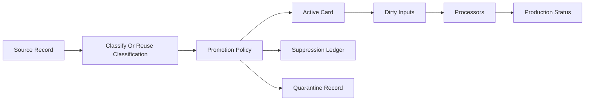
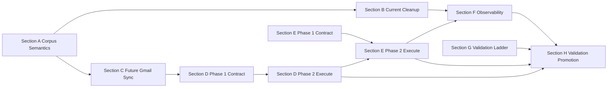

# PPA v2.5 Vision - Production Hardening for Arnold

---

## The Core Thesis

v2 is closed. Phase 9 is complete. Arnold is running a v2 PPA that works for one person, on one production machine, with the v2 card model, index, embeddings, enrichment, linkers, and maintenance surface in place.

v2.5 is the production-hardening release between v2 and v3. It does not make PPA installable by strangers. It does not introduce Docker packaging, a setup wizard, encryption UX, contribution workflows, or native-app surface area. v2.5 makes the live Arnold archive cleaner, fresher, easier to operate, and precise enough that v3 can package stable engine behavior instead of packaging a one-off snapshot.

The core problem is that v2 proved the archive can exist. v2.5 proves the archive can stay healthy.

Two things define that shift:

1. **Corpus quality:** marketing and bulk email should not occupy the same active archive surface as personal correspondence, transactions, calendar-bearing threads, and typed artifacts. Gmail can remain the source of record for bulk mail; PPA should be the high-signal active corpus.

2. **Freshness:** each source must have a clear updater contract, cursor, dirty-set model, and downstream processor invalidation path. Extractors, enrichment, embeddings, and linkers must be able to refresh from changed inputs without treating the archive as a frozen March snapshot.

3. **Safe progression:** v2.5 changes must graduate through fixtures, slices, local seed/staging, Arnold dry-run, Arnold reviewed apply, and Arnold soak. Arnold is the final target, not the first proof point.

Planning docs and Phase-1 implementation for Sections A–G are landed on branch `v2.5`. What remains is closing the live-update loop (D/E Phase 2), then proving it through Section H before v3 packaging.

---

## Implementation Sequence

v2.5 was implemented in this order (Phase 1 = contracts / control plane):

1. **Section G:** validation ladder, report shape, engine-mode reporting, refusal rules.
2. **Section A:** `EmailPromotionPolicy` semantics and synthetic fixture tests.
3. **Section B dry-run:** classification reuse and dry-run corpus census.
4. **Section B apply/rollback:** staging apply and rollback on slices/seed staging tooling.
5. **Section C:** Gmail classify-before-promotion (gate wired into adapter; production enablement gated).
6. **Section D Phase 1:** source updater declarations, batch report shapes, status snapshots, cursor-safety helpers.
7. **Section E Phase 1:** processor declarations, staleness/plan surfaces, status snapshots.
8. **Section F Phase 1:** `ppa status` / readiness surfaces consuming B/D/E/G state.

**Remaining sequence (required before v3):**

9. **Section D Phase 2:** execute source updaters — run existing adapters under the contract, commit batches/cursors, emit dirty UIDs. Gmail + Calendar first; iMessage/Photos next.
10. **Section E Phase 2:** execute processors on dirty UIDs; wire into `ppa maintain` (update sources → process dirty → report). No full rebuild/embed/linker runs by default.
11. **Section F readiness hardening:** fail closed unless real updater-run and processor-run evidence exists (not snapshot-only).
12. **Section H:** prove the loop — focused tests → slices → seed updater proof → Arnold code deploy → Arnold updater proof → corpus dry-run/apply → soak → `ppa readiness` ready.

Do not start Arnold corpus apply, broad processor execution, or v3 packaging before D/E Phase 2 and the corresponding H gates pass.

---

## Current Status and Path From Here

### What is true now

| Area                                                | Status                                                                           |
| --------------------------------------------------- | -------------------------------------------------------------------------------- |
| Email promotion policy (A)                          | Implemented                                                                      |
| Corpus hygiene dry-run + apply/rollback tooling (B) | Implemented; **not** applied on Arnold                                           |
| Gmail classify-before-promote (C)                   | Implemented behind gate flags                                                    |
| Source updater **contract** (D Phase 1)             | Implemented — declarations, reports, snapshots                                   |
| Source updater **execution** (D Phase 2)            | **Missing** — adapters are not run as updaters; `maintain` only snapshots status |
| Processor **contract** (E Phase 1)                  | Implemented — declarations, plans, staleness helpers                             |
| Processor **execution** (E Phase 2)                 | **Missing** — dirty UIDs are not processed through the DAG                       |
| Status / readiness UI (F)                           | Implemented; readiness must stay fail-closed until H proof                       |
| Validation ladder (G)                               | Implemented                                                                      |
| Validation/promotion runbook (H)                    | Documented; **not yet executed**                                                 |

`ppa maintain` still does Phase 8 work (tail `ingestion_log` → extract → entity resolve → rebuild) plus optional status snapshots. It does **not** yet pull Gmail/Calendar/iMessage/Photos or drive processors from dirty UIDs.

### Path that unblocks v3

```text
D Phase 2 (run updaters)
  → E Phase 2 (run processors on dirty UIDs; maintain owns the cycle)
  → H proves seed then Arnold freshness
  → B Arnold dry-run → reviewed apply (clean corpus)
  → H soak → ppa readiness READY
  → only then start v3 packaging (setup wizard, Docker, docs)
```

### v3 prerequisites delivered by this path

| Prerequisite                              | Why v3 needs it                                  | v2.5 delivery                  |
| ----------------------------------------- | ------------------------------------------------ | ------------------------------ |
| High-signal corpus                        | Self-hosters must not inherit a marketing mirror | A–C + Arnold B apply           |
| Scheduled maintain that refreshes sources | v3 maintainer container assumes this             | D/E Phase 2 + maintain wire-up |
| Incremental processors                    | Cannot afford full re-extract/re-embed           | E Phase 2 dirty-set execution  |
| Fail-closed readiness                     | Operators need an honest “is it healthy?”        | F + H soak evidence            |
| Proven on one production machine          | Package stable behavior, not a snapshot          | H through Arnold soak          |

---

## Implementation Control Plane

All v2.5 commands and jobs should follow these defaults:

- Dry-run by default for corpus hygiene and future-sync evaluation.
- Apply requires a `decision_run_id`.
- Arnold apply requires an Arnold-generated dry-run decision run and an explicit confirmation guard.
- Full email reclassification requires an explicit opt-in flag.
- Full embedding regeneration requires an explicit opt-in flag.
- All-linker reruns require an explicit opt-in flag.
- Every long operation writes JSON and human-readable reports.
- Every report records ladder gate, archive instance, engine mode, counts, elapsed runtime, throughput, warnings/errors, and next recommended gate.
- Any Rust/Python divergence in active/suppressed materialization, chunking, or retrieval behavior blocks Arnold apply.

The implementation entrypoint for future agents is [v2_5_execution_plans/README.md](v2_5_execution_plans/README.md). That README defines the shared logical contracts, CLI defaults, validation matrix, stop conditions, and final readiness checklist that apply across all section plans.

---

## Principles

v2 principles remain in force. v2.5 adds:

11. **Source records are not automatically archive artifacts.** A provider record can be observed without becoming an active PPA card. Promotion into the active corpus is a policy decision.

12. **Gmail is the source of record for bulk email; PPA is the active life corpus.** PPA should keep the emails that matter to memory, recall, structured extraction, correspondence, and provenance. It does not need to be a second full Gmail mirror.

13. **Historical cleanup and future sync use the same policy.** The cleanup path for Arnold's existing email corpus and the promotion path for newly synced Gmail threads must share one `EmailPromotionPolicy`.

14. **Existing classification is an asset.** v2.5 must reuse `card_classifications`, `_artifacts/_classify_index*.db`, `ClassifyIndex`, and `email_thread.triage_classification` before making new LLM calls. Reclassification is only for missing, stale, or explicitly invalidated inputs.

15. **Corpus membership and typed extraction are separate decisions.** A personal thread can be active without being typed-extractable. A transactional receipt can be active and typed-extractable. A marketing email can be suppressed even if it once existed as an `email_message` card.

16. **Suppression is auditable.** Suppressed records get durable metadata: source identity, external IDs, hash/history markers, classification source, policy version, decision reason, and linked prior card UIDs when applicable.

17. **Routine sync does not silently demote active history.** New records may be suppressed before card creation. Existing active cards are demoted only by an explicit hygiene apply command with dry-run output and rollback.

18. **Refresh is processor-driven, not rebuild-driven.** Source updaters produce dirty inputs. Processors decide whether their outputs are stale based on input hashes, processor versions, dependencies, and corpus state.

19. **Production health must be visible.** `ppa status` and maintenance reports should explain source freshness, corpus health, processor backlog, suppression counts, and readiness for v3.

20. **Rust hot paths are the default validation engine.** v2.5 should use the existing Rust engine for vault scans, cache reads, materialization, chunking, and slice/seed validation wherever Phase 2.9 already proved the Rust path. Python fallbacks are for parity testing and unsupported paths, not the default for long corpus jobs.

---

## What v2.5 Is / Is Not

**v2.5 is:**

- A production-hardening release for Arnold.
- A corpus hygiene and freshness design.
- A path to clean the existing Arnold email corpus without wasting model calls.
- A path to classify future Gmail records before card promotion.
- A source updater contract for Gmail, Calendar, iMessage, Photos, and future sources.
- A processor DAG contract for extraction, enrichment, embeddings, and linkers.
- An observability and readiness layer for the live archive.
- A validation ladder that proves changes on slices and seed/staging before Arnold.

**v2.5 is not:**

- A v3 setup wizard.
- Docker Compose packaging.
- A multi-user/self-hosting release.
- A native app.
- A new card-type expansion.
- A second full rebuild of product philosophy.
- A code implementation in this documentation pass.
- A permission slip to mutate Arnold before slice, seed/staging, dry-run, rollback, and readiness gates pass.

---

## Current State

Arnold's v2 PPA is assumed live and running after Phase 9.

The current architecture already has many pieces v2.5 should use:

- Source adapters with cursor-like behavior via `fetch_batches`, `cursor_patch`, and `_meta/sync-state.json`.
- Gmail quick-update behavior around `gmail_history_id` and body hashes.
- Calendar, iMessage, Photos, and other adapters with source-specific incremental markers.
- LLM email enrichment with Stage 0 deterministic gates, Stage 1 lightweight classification, and Stage 2 extraction.
- `ClassifyIndex`, designed to classify threads once and reuse classification across runs.
- Durable `card_classifications` in Postgres.
- `email_thread.triage_classification` frontmatter fields.
- `ppa maintain`, `ingestion_log`, and maintenance watermarks.
- Embedding and linker pipelines that can already exclude classified junk in some downstream paths.
- A Rust engine that already owns major scan/cache/materialization/chunking hot paths from Phase 2.9.

The gap is not absence of ingredients. The gap is that the ingredients are not yet one production contract.

Today, marketing email is mostly filtered after it has already entered the vault and database. Future sync is mostly an adapter concern, while downstream freshness is a maintenance concern. v2.5 connects those into one lifecycle:



---

## Target Architecture

v2.5 introduces four durable concepts.

### 1. Email Corpus Decisions

Every Gmail thread has, or can derive, a corpus decision:

- `active`: first-class archive artifact.
- `suppressed`: compact ledger record only.
- `quarantine`: reviewable ambiguous record, excluded from default retrieval and downstream work.

The decision is produced by `EmailPromotionPolicy`, using existing classification first and new LLM classification only when needed.

### 2. Source Updaters

Every source has a stable updater contract:

- source identity and account/scope.
- provider cursor or local watermark.
- adapter and promotion policy versions.
- committed batches of observed/promoted/suppressed/quarantined/deleted records.
- dirty card UIDs for downstream processors.
- last success/error/status metadata.

### 3. Processor DAG

Extraction, enrichment, embeddings, and linkers become explicit processors with:

- input filters.
- processor versions.
- input hashes.
- output identities.
- dependency ordering.
- stale-output detection.
- active/suppressed/quarantine awareness.

### 4. Arnold Observability

Production status shows:

- source freshness.
- corpus counts.
- classification coverage.
- suppression/quarantine counts.
- processor backlog.
- embedding and linker health.
- maintenance failures and rollback points.
- v3 readiness status.

### 5. Validation Ladder and Rust Execution Standard

Every v2.5 implementation path must record which gate it is running:

```text
synthetic fixtures -> small slice -> larger slice -> local seed dry-run -> local seed staging apply -> Arnold dry-run -> Arnold reviewed apply -> Arnold soak/readiness
```

Every long corpus operation should report engine mode. `PPA_ENGINE=rust` is the default for supported scan/cache/materialization/chunking validation paths.

### 6. Validation and Promotion Runbook

Once Sections A-G are implemented, v2.5 moves into an operational validation phase:

```text
focused tests -> synthetic gate -> smoke slice -> larger slice -> local seed dry-run -> local seed staging apply/rollback -> Arnold dry-run -> Arnold reviewed apply -> Arnold soak/readiness
```

This phase is documented in [section_h_validation_promotion_runbook.plan.md](v2_5_execution_plans/section_h_validation_promotion_runbook.plan.md). Section H does not add new product behavior; it is the prescribed way to prove v2.5 is safe to promote.

---

## Section A: Email Corpus Semantics

**Execution plan:** [section_a_email_corpus_semantics.plan.md](v2_5_execution_plans/section_a_email_corpus_semantics.plan.md)

**What it is:** The conceptual foundation for v2.5 email quality. This section defines `active`, `suppressed`, and `quarantine` states; separates `corpus_decision` from `processor_decision`; and establishes `EmailPromotionPolicy` as the single policy used by both historical cleanup and future Gmail sync.

**Why it exists:** v2 treated too much raw email as a digital artifact. The enrichment pipeline later learned how to skip marketing, automated, and noise categories for extraction, but the active corpus still contains those records. v2.5 moves the decision earlier and makes it durable.

**Design decisions:**

- Gmail corpus decisions happen at thread level.
- Messages and attachments inherit the thread decision unless a future attachment policy says otherwise.
- The current LLM classifier remains the classifier. v2.5 does not create a second marketing-specific model path.
- Existing classification outputs are reused before new LLM calls.
- Personal correspondence can stay active even when it is not typed-extractable.
- Transactional email is active and usually queued for typed extraction.
- Marketing, automated, and noise email is suppressed unless override signals apply.

**Definition of Done:**

- The execution plan defines all corpus states and decision outputs.
- The execution plan defines promotion inputs and outcomes.
- The execution plan includes concrete examples for marketing, transactional, personal, starred promotional, and ambiguous threads.
- Later sections can reference `EmailPromotionPolicy` without redefining it.

---

## Section B: Current Arnold Corpus Cleanup

**Execution plan:** [section_b_current_arnold_cleanup.plan.md](v2_5_execution_plans/section_b_current_arnold_cleanup.plan.md)

**What it is:** The historical cleanup plan for the already-running Arnold PPA. It explains how to canonicalize existing classification, generate a dry-run census, review suppression/quarantine buckets, apply cleanup safely, preserve derived artifacts, and roll back without rerunning models.

**Why it exists:** Arnold already contains hundreds of thousands of email-derived artifacts. Future sync hygiene is not enough. v2.5 must also clean the active corpus that already exists.

**Design decisions:**

- Cleanup is DB-first and rebuild-safe.
- The first pass does not physically delete vault markdown.
- Existing classification is canonical unless missing or stale.
- Policy-version changes reinterpret classification; they do not automatically reclassify with an LLM.
- Suppressed raw emails can still be provenance for active derived cards.
- Manual overrides are policy inputs, not ad hoc edits.

**Definition of Done:**

- The execution plan specifies classification precedence.
- The execution plan specifies the `email_corpus_decisions` or equivalent durable decision store.
- The execution plan specifies the dry-run report, review buckets, apply flow, validation, and rollback.
- The execution plan makes clear that cleanup will not rerun classification for all email.

---

## Section C: Future Gmail Sync Promotion

**Execution plan:** [section_c_future_gmail_sync_promotion.plan.md](v2_5_execution_plans/section_c_future_gmail_sync_promotion.plan.md)

**What it is:** The forward-looking Gmail sync plan. It moves classification between source fetch and card promotion for newly observed or changed Gmail threads.

**Why it exists:** Once Arnold is cleaned, future sync must not refill the archive with the same marketing corpus. The same policy used for cleanup must run on future records before they become vault cards.

**Design decisions:**

- Future Gmail sync uses minimal metadata hydration before card creation.
- Existing `ClassifyIndex`, `card_classifications`, and inference cache are checked before model calls.
- Suppressed threads write ledger records and advance cursors without producing `email_thread`, `email_message`, or `email_attachment` cards.
- Previously suppressed threads can be promoted later if new owner interaction or transactional signals appear.
- Routine sync records demotion recommendations for active cards but does not silently demote them.

**Definition of Done:**

- The execution plan defines the future Gmail sync lifecycle.
- The execution plan specifies cursor safety when records are suppressed before card creation.
- The execution plan specifies how classification reuse works for new sync.
- The execution plan defines promotion, suppression, quarantine, and re-promotion behavior.

---

## Section D: Source Updater Contract

**Execution plan:** [section_d_source_updater_contract.plan.md](v2_5_execution_plans/section_d_source_updater_contract.plan.md)

**What it is:** The product-level freshness contract above existing adapters. It names what every source updater must declare, what each committed batch returns, and how downstream systems discover dirty cards.

**Why it exists:** v2 has adapter-level cursors, but no canonical updater model across sources. v2.5 makes freshness a first-class contract.

**Implementation phases:**

- **Phase 1 (landed):** declarations, batch report shapes, status snapshots, cursor helpers, CLI read paths.
- **Phase 2 (remaining):** execute updaters by running existing adapters under the contract; commit batches/cursors; emit dirty UIDs; integrate into `ppa maintain`. Snapshots alone do not count as freshness.

**Design decisions:**

- `SourceUpdater` is a contract layered over existing adapters, not a new source framework from scratch.
- Each updater has stable source identity, adapter version, cursor state, last success/error, and capability metadata.
- Each committed batch reports observed, promoted, suppressed, quarantined, deleted/tombstoned, dirty UIDs, and cursor patches.
- Gmail is promotion-gated; Calendar, iMessage, Photos, Health, and structured sources get source-specific defaults.
- Cursor patches commit only after all batch side effects are safely persisted.

**Definition of Done:**

- Phase 1: declarations, batch reports, cursor safety helpers, and status snapshots exist (landed).
- Phase 2: Gmail and Calendar updaters actually run adapters, commit cursors only after persisted side effects, and emit dirty UIDs into the processor path.
- iMessage and Photos updaters run under the same contract (may follow Gmail/Calendar if gated).
- `ppa maintain` can invoke enabled source updaters (not only snapshot their state).
- Section H seed and Arnold updater gates pass for required sources.

---

## Section E: Processor DAG

**Execution plan:** [section_e_processor_dag.plan.md](v2_5_execution_plans/section_e_processor_dag.plan.md)

**What it is:** The plan to make extractors, enrichment, embeddings, and linkers refreshable from dirty inputs and processor versions.

**Why it exists:** The extractor paradigm should become the refresher paradigm. A source update should trigger only the downstream work made stale by that update.

**Implementation phases:**

- **Phase 1 (landed):** processor declarations, staleness/plan helpers, run report shapes, status CLI, maintain snapshot hooks.
- **Phase 2 (remaining):** execute processors on dirty UIDs from D Phase 2; wire into `ppa maintain`; no full embedding/linker/LLM reruns by default.

**Design decisions:**

- Every processor has a key, version, input filter, input hash, output identity, dependency list, and status.
- Processors rerun because inputs changed, upstream dependencies changed, or processor versions changed.
- Processors do not rerun just because time passed, unless the source itself is time-sensitive.
- Email classification is not rerun for already-classified threads unless content hash or policy explicitly requires it.
- Embedding and linker processors operate on active cards only.
- Prefer invoking existing extract/enrich/embed/link entrypoints over inventing a new workflow engine.

**Definition of Done:**

- Phase 1: declarations, staleness/plan, and status surfaces exist (landed).
- Phase 2: dirty UIDs from source updaters map to executable processor plans that run only affected work.
- `ppa maintain` sequences: source updaters → materialize/process dirty → report.
- Suppressed inputs skip active-only processors.
- Section H proves incremental processor execution on seed and Arnold.

---

## Section F: Arnold Observability + v3 Readiness Gate

**Execution plan:** [section_f_arnold_observability_v3_gate.plan.md](v2_5_execution_plans/section_f_arnold_observability_v3_gate.plan.md)

**What it is:** The production status and readiness plan. It defines what Arnold must report about source freshness, corpus health, processor state, maintenance failures, and v3 readiness.

**Why it exists:** v3 should package a system with known operational guarantees. Arnold must prove the PPA can stay fresh and high-signal through normal maintenance before the setup wizard and Docker packaging expose it to other users.

**Design decisions:**

- `ppa status` becomes the human-readable production dashboard.
- Maintenance reports are append-only and machine-readable.
- Corpus health includes active/suppressed/quarantine counts.
- Freshness includes source cursors, last success/error, and recent promoted/suppressed/quarantined counts.
- v3 readiness is explicit and fails closed if freshness, cleanup, processor, or suppression guarantees are not met.
- **Source freshness and processor health require real run evidence** (committed updater batches / processor runs), not declaration snapshots alone.

**Definition of Done:**

- Status/readiness surfaces exist (Phase 1 landed).
- Readiness fails closed until Section H records: updater proof, corpus apply (when required), processor soak, and Arnold gate evidence.
- Snapshot-only source/processor state cannot flip readiness to ready.

---

## Section G: Validation Ladder + Rust Execution Standard

**Execution plan:** [section_g_validation_ladder_rust_standard.plan.md](v2_5_execution_plans/section_g_validation_ladder_rust_standard.plan.md)

**What it is:** The operational promotion path for v2.5 implementation work. It defines the required progression through synthetic fixtures, real slices, local seed dry-run, local seed staging apply, Arnold dry-run, Arnold reviewed apply, and Arnold soak. It also defines when and how to use the Rust engine to avoid unnecessary wall time.

**Why it exists:** The corpus cleanup and refresh changes are production-sensitive. Without an explicit ladder, the docs say what to build but not how to move safely from code to Arnold. Section G prevents long, risky jobs from running first on seed or production.

**Design decisions:**

- Arnold apply is blocked until slice and local seed/staging apply/rollback have passed.
- Arnold apply uses a decision run generated by Arnold dry-run.
- The canonical seed is never the first apply target.
- Rust scan/cache/materialization/chunking paths are default for validation where supported.
- Long jobs must report engine mode, elapsed runtime, throughput, and next gate recommendation.
- Full reclassification, full embedding, and full linker reruns are opt-in exceptions, not defaults.

**Definition of Done:**

- The execution plan defines the full validation ladder.
- The execution plan defines Rust engine usage standards.
- The execution plan defines wall-time and seed/Arnold safety guardrails.
- Section F readiness depends on Section G gates passing.

---

## Section H: Validation + Promotion Runbook

**Execution plan:** [section_h_validation_promotion_runbook.plan.md](v2_5_execution_plans/section_h_validation_promotion_runbook.plan.md)

**What it is:** The operational runbook for proving v2.5 after D/E Phase 2. It sequences focused tests, slices, **local seed source-updater + processor proof**, Arnold code deploy, **Arnold source-updater + processor proof**, corpus hygiene dry-run/apply, soak, and readiness.

**Why it exists:** Phase-1 machinery and corpus tooling are not enough. Section H proves the archive stays clean **and** fresh under normal maintain — the prerequisite for v3 packaging.

**Design decisions:**

- Section H runs after D/E Phase 2 (execution), not merely after Phase-1 contracts.
- Section H does not invent new product behavior; it may require small CLI flags already specified in D/E Phase 2.
- Corpus apply on Arnold is gated behind seed and Arnold **updater** proof, not only synthetic tests.
- Recording `--record-source-status` is **not** updater proof; cursors must advance from real adapter runs.
- Exact Arnold deploy uses hey-arnold `ppa-sync` + `ppa-install` (+ migrate / restart MCP). Full Phase 9 `ppa-deploy-v2` rebuild is **not** the default for code-only v2.5 promotion.

**Definition of Done:**

- Focused tests and slice gates pass.
- Seed: each required source updater advances cursor / reports success; dirty UIDs process; maintain cycle works.
- Arnold: same updater + processor proof after code deploy.
- Arnold corpus dry-run reviewed; apply succeeds; soak passes.
- `ppa readiness --format json` reports ready with real-run evidence.

---

## Dependencies Between Sections



Phase 1 of A–G is landed. The critical remaining edge is **D Phase 2 → E Phase 2 → H**. Section B Arnold apply is part of H after updater proof, so corpus cleanup and live freshness land together as one production story.

---

## Risks

| Risk                                                  | Why it matters                                                                                                    | Mitigation                                                                                         |
| ----------------------------------------------------- | ----------------------------------------------------------------------------------------------------------------- | -------------------------------------------------------------------------------------------------- |
| Over-suppressing meaningful email                     | Personal history could disappear from default recall                                                              | Use explicit active overrides, quarantine conflicts, dry-run samples, and rollback                 |
| Reclassifying too much email                          | Wastes cost and may drift from known-good extraction results                                                      | Reuse `card_classifications`, `ClassifyIndex`, frontmatter, and content hashes before model calls  |
| Rebuild re-promotes suppressed email                  | Cleanup becomes temporary                                                                                         | Make corpus decisions durable and materializer-visible                                             |
| Derived cards lose provenance                         | Suppressing raw receipts could break trust in structured cards                                                    | Preserve useful derived cards and keep source email provenance                                     |
| Future sync diverges from cleanup                     | Marketing returns through the back door                                                                           | Use one `EmailPromotionPolicy` for both historical cleanup and future sync                         |
| Processor DAG becomes too abstract                    | Implementation stalls on framework work                                                                           | Phase 2 must invoke existing extract/enrich/embed/link entrypoints; no new workflow engine         |
| D/E Phase 1 mistaken for live update                  | Status looks green while sources are stale                                                                        | H requires real updater/processor run evidence; F readiness fails closed on snapshots alone        |
| v3 starts before Arnold is proven                     | Packaging exposes an unstable lifecycle                                                                           | Require the v3 readiness gate in Section F after H soak                                            |
| Long corpus jobs consume wall time without confidence | Full vault walks, full reclassification, full embeddings, or all-linker runs can burn cycles and obscure failures | Require Section G guardrails, Rust engine defaults, count/sample modes, progress, and JSON reports |
| Seed or Arnold is mutated too early                   | A bad apply can corrupt the proof corpus or production archive                                                    | Require slice gates, local seed staging apply/rollback, Arnold dry-run, and reviewed Arnold apply  |
| Rust/Python divergence hides data issues              | Performance wins are unsafe if outputs differ                                                                     | Treat Rust/Python divergence as blocking before Arnold apply                                       |
| Validation phase becomes ad hoc                       | Operators may skip slice/seed gates or lose report evidence                                                       | Use Section H as the required validation/promotion runbook                                         |

---

## Definition of Done

**Documentation / Phase-1 handoff is complete when:**

- Vision + execution plans define contracts, phases, and the remaining path.
- D/E clearly separate Phase 1 (landed) from Phase 2 (execution remaining).
- H is an executable runbook including updater proof and Arnold deploy.

**v2.5 product is complete when:**

- D Phase 2 and E Phase 2 are implemented and committed.
- Section H has passed through Arnold soak.
- `ppa readiness --format json` reports ready with real updater/processor evidence.
- Suppressed marketing email is excluded from default retrieval, embeddings, linkers, and enrichment queues.
- Future Gmail sync uses classify-before-promotion.
- Rollback remains available for the Arnold corpus apply run.
- v3 packaging work may begin only after the above.

---

## Summary Table

| Section | Name                              | Purpose                                                         | Status                          | Execution plan                                                                       |
| ------- | --------------------------------- | --------------------------------------------------------------- | ------------------------------- | ------------------------------------------------------------------------------------ |
| A       | Email Corpus Semantics            | Define active/suppressed/quarantine and `EmailPromotionPolicy`  | Phase 1 done                    | [section_a…](v2_5_execution_plans/section_a_email_corpus_semantics.plan.md)          |
| B       | Current Arnold Corpus Cleanup     | Clean existing email corpus using existing classification first | Tooling done; Arnold apply in H | [section_b…](v2_5_execution_plans/section_b_current_arnold_cleanup.plan.md)          |
| C       | Future Gmail Sync Promotion       | Classify before card promotion for new/changed Gmail threads    | Gate done; enable in H          | [section_c…](v2_5_execution_plans/section_c_future_gmail_sync_promotion.plan.md)     |
| D       | Source Updater Contract           | Freshness contract + **execute adapters**                       | Phase 1 done; **Phase 2 next**  | [section_d…](v2_5_execution_plans/section_d_source_updater_contract.plan.md)         |
| E       | Processor DAG                     | Refresh extract/enrich/embed/link from dirty inputs             | Phase 1 done; **Phase 2 next**  | [section_e…](v2_5_execution_plans/section_e_processor_dag.plan.md)                   |
| F       | Arnold Observability + v3 Gate    | Production health and readiness for v3                          | Surfaces done; harden evidence  | [section_f…](v2_5_execution_plans/section_f_arnold_observability_v3_gate.plan.md)    |
| G       | Validation Ladder + Rust Standard | Fixtures → slices → seed → Arnold rails                         | Done                            | [section_g…](v2_5_execution_plans/section_g_validation_ladder_rust_standard.plan.md) |
| H       | Validation + Promotion Runbook    | Prove live update + clean corpus through readiness              | **After D/E Phase 2**           | [section_h…](v2_5_execution_plans/section_h_validation_promotion_runbook.plan.md)    |
