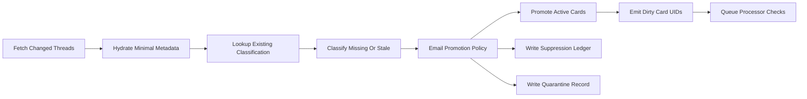

# Section C Execution Plan - Future Gmail Sync Promotion

## Objective

Specify how future Gmail syncs should classify and promote records before creating active PPA cards.

This plan makes the Gmail adapter lifecycle use the same `EmailPromotionPolicy` defined in Section A and the same decision store defined in Section B. The goal is to prevent future sync from reintroducing marketing/bulk/noise email into the active corpus after Arnold is cleaned.

## Non-Goals

- Do not implement Gmail adapter changes in this planning pass.
- Do not remove the existing Gmail adapter.
- Do not require Gmail History API migration before any improvement can ship; page-token scanning can remain a fallback.
- Do not silently demote already-active cards during routine sync.
- Do not physically delete suppressed email from Gmail or the local vault.
- Do not create a new classifier separate from the current LLM enrichment classifier.

## Existing Code and Docs to Inspect Before Implementation

- `ppa/archive_docs/vision/v2_5_execution_plans/README.md`
- `ppa/archive_docs/vision/v2.5vision.md`
- `ppa/archive_docs/vision/v2_5_execution_plans/section_a_email_corpus_semantics.plan.md`
- `ppa/archive_docs/vision/v2_5_execution_plans/section_b_current_arnold_cleanup.plan.md`
- `ppa/archive_sync/adapters/base.py`
- `ppa/archive_sync/adapters/gmail_messages.py`
- `ppa/archive_vault/sync_state.py`
- `ppa/archive_sync/llm_enrichment/classify.py`
- `ppa/archive_sync/llm_enrichment/classify_index.py`
- `ppa/archive_sync/llm_enrichment/enrich_runner.py`
- `ppa/archive_sync/llm_enrichment/known_senders.py`
- `ppa/archive_sync/llm_enrichment/threads.py`

## Agent Handoff Checklist

Before implementation:

- Read `README.md`, `v2.5vision.md`, Sections A, B, D, G, and this plan.
- Confirm the decision store and `EmailPromotionPolicy` exist before changing Gmail sync mutation.
- Start with future-sync dry-run/report mode.
- Do not enable production Gmail mutation until slice, seed staging, and Arnold dry-run gates pass.

Likely implementation files:

- `archive_sync/adapters/gmail_messages.py`
- `archive_sync/adapters/base.py` only if batch metadata needs a small extension.
- source updater/report modules introduced by Section D.
- tests under `archive_tests/` using Gmail-like fixtures.

Required first tests:

- suppressed Gmail thread creates ledger/decision record but no cards.
- active Gmail thread still writes cards through existing path.
- cursor advances only after ledger/card writes persist.
- previously suppressed thread can be promoted after owner action.

Stop conditions:

- implementation needs full thread bodies for obvious suppressed records.
- suppressed records are skipped without durable ledger.
- cursor can advance past failed classification or failed ledger write.
- routine sync demotes existing active cards without explicit hygiene apply.

## Target Lifecycle

Future Gmail sync should follow this lifecycle:

## C1. Minimal Metadata Hydration

The future Gmail adapter should split hydration into two levels:

### Minimal Hydration

Enough to classify/promote without writing cards:

- `gmail_thread_id`
- `gmail_history_id`
- subject
- snippet
- from emails
- participant emails
- owner aliases and owner participation signal
- label IDs
- message count
- first/last message timestamps
- attachment presence
- calendar/invite hints if available cheaply
- body hash if already available or cheap to compute

### Full Hydration

Only for records that become active or require classification from content:

- full message bodies.
- attachment metadata and capped attachment payloads.
- full thread body hash.
- card bodies/frontmatter.

Design decision: future sync should not pay full vault-card hydration cost for obvious suppressed records unless classification requires more content.

## C2. Classification Reuse Before Model Calls

For every changed or newly observed thread, sync should check classification in this order:

1. Current `email_corpus_decisions` record with matching `gmail_thread_id`, `thread_body_sha`, and compatible policy/classifier versions.
2. `ClassifyIndex` record with matching `gmail_thread_id`.
3. `card_classifications` record if the thread was previously promoted.
4. `email_thread.triage_classification` if an active card already exists.
5. Deterministic Stage 0 gate from known senders/noise patterns.
6. New lightweight LLM classification.

The implementation should distinguish:

- `classification_reused`
- `classification_reinterpreted`
- `classification_new_llm`
- `classification_missing_but_stage0_decided`

These values should be reported in source-updater batch metrics.

## C3. Promotion Outcomes

### Active

When policy returns `active`:

- Write `email_thread`, `email_message`, and `email_attachment` cards through the existing adapter write path.
- Write/update the decision record.
- Emit dirty card UIDs for processor checks.
- Mark the source batch with `promoted += 1`.

### Suppressed

When policy returns `suppressed`:

- Do not create `email_thread`, `email_message`, or `email_attachment` cards.
- Write/update the suppression ledger or `email_corpus_decisions` record.
- Include enough metadata to avoid reclassifying the same thread on the next sync.
- Advance the source cursor after the ledger write succeeds.
- Mark the source batch with `suppressed += 1`.

### Quarantine

When policy returns `quarantine`:

- Do not create active cards.
- Write a compact review record with classification and signal metadata.
- Do not embed, link, or enrich by default.
- Mark the source batch with `quarantined += 1`.

## C4. Cursor Safety

Cursor advancement must account for records not promoted to cards.

Rules:

- A thread can advance the Gmail cursor if its decision record or card writes have been durably persisted.
- Suppressed records must be represented in the ledger before cursor commit.
- Quarantine records must be represented in the review/decision store before cursor commit.
- If classification fails, do not advance the cursor past that thread unless the failure is recorded as retryable and the source can revisit it.
- Batch `cursor_patch` should commit only after all active card writes, suppression ledger writes, quarantine records, and dirty-set emissions are persisted.

This preserves the existing `BaseAdapter` principle that cursor patches are applied only after batch success.

## C5. Re-Promotion

Suppressed records can become active later.

Triggers:

- owner replies to or sends in the thread.
- thread gains `STARRED` or `IMPORTANT`.
- thread receives a new transactional message.
- thread classification changes because content hash changed.
- manual override forces active.

When re-promoting:

- create active vault cards.
- update the decision record from `suppressed` to `active`.
- retain suppression history for audit.
- emit dirty UIDs for processors.
- report `re_promoted += 1`.

## C6. Existing Active Thread Behavior

Routine sync should not silently demote already-active cards.

If an existing active thread later evaluates to suppressed:

- update decision store with `recommended_state = suppressed`.
- keep current active cards unchanged.
- include the recommendation in a hygiene report.
- require explicit `corpus-hygiene apply` to demote.

This prevents routine sync from unexpectedly changing historical recall.

## C7. Gmail History API Preference

Implementation should prefer Gmail History API for incremental changes:

- Store account-level history cursor.
- Fetch changed message/thread IDs since last successful sync.
- Fall back to page-token scanning when history cursor is unavailable, expired, or insufficient.
- Use existing quick-update hashes to avoid rewriting unchanged active cards.

History cursor failures should be visible in source status and should not silently force a full expensive scan without reporting.

## C8. Adapter Integration Points

Likely future implementation touchpoints:

- `archive_sync/adapters/gmail_messages.py`
  - add minimal thread metadata path.
  - call classification/promotion policy before `to_card`.
  - emit suppressed/quarantine counts.
  - write decision records before cursor commit.
- `archive_sync/adapters/base.py`
  - preserve existing batch/cursor safety semantics.
  - possibly generalize batch metadata for `promoted`, `suppressed`, `quarantined`.
- `archive_vault/sync_state.py`
  - include policy/classification cursor metadata if needed.
- `archive_sync/handler.py`
  - expose source-sync flags if necessary.

Do not fork the Gmail adapter into a separate marketing-filtered adapter unless implementation proves the existing adapter cannot support the lifecycle cleanly.

## C9. Processor Handoff

Active promotion should emit enough dirty data for Section E:

- active thread UID.
- message UIDs.
- attachment UIDs.
- decision record ID.
- processor hints:
  - `typed_extraction` for transactional.
  - `thread_enrichment` for personal/correspondence.
  - `embedding` for all active cards/chunks.
  - `linkers` for active cards only.

Suppressed and quarantine decisions should not enqueue embeddings, linkers, or enrichment by default.

## C10. Tests and Validation

Future implementation should include:

- Unit tests for active/suppressed/quarantine promotion outcomes.
- Unit tests proving suppressed records do not create cards.
- Unit tests proving suppressed records do advance cursor after ledger persistence.
- Unit tests proving cursor does not advance when classification/write fails.
- Unit tests proving existing classification is reused before LLM calls.
- Integration tests with a small Gmail-like fixture:
  - new marketing thread.
  - new transactional receipt.
  - new personal reply thread.
  - previously suppressed thread that gets a reply.
  - previously active thread later recommended for suppression.
- Idempotency tests: running sync twice does not create duplicate ledger rows or duplicate cards.

## C11. Validation Ladder and Rust Standard

Future Gmail sync cannot be enabled on Arnold until it passes the Section G ladder.

Required gates:

1. **Synthetic fixtures:** promotion, suppression, quarantine, re-promotion, and demotion recommendation cases pass.
2. **Small slice:** replay or simulate changed Gmail threads and verify classify-before-promotion behavior.
3. **Larger slice:** validate cursor safety and classification reuse without broad LLM calls.
4. **Local seed dry-run:** future-sync policy is evaluated against seed-like records without card writes.
5. **Local seed staging apply:** promoted/suppressed/quarantine writes are tested against staging state.
6. **Arnold dry-run:** report what future sync would do without changing production cards.
7. **Arnold reviewed enablement:** enable future sync only after dry-run review.

Rust standard:

- Use Rust cache/type-filtered reads when looking up existing cards/classifications during slice and seed validation.
- Record engine mode in sync dry-run reports.
- Use Rust materialization validation for any active cards produced during staging apply.
- Do not use slow full-vault Python walks to find existing Gmail state when indexed/cache-backed paths are available.

## Operational Reporting

Each Gmail updater run should report:

- observed threads.
- unchanged skipped threads.
- promoted threads.
- suppressed threads.
- quarantined threads.
- re-promoted threads.
- active-demotion recommendations.
- classification reuse count.
- new LLM classification count.
- classification failures.
- cursor start/end.
- history API fallback reason, if any.

These metrics feed Section F status.

## Rollback / Recovery

Rollback should be possible by decision records:

- Suppressed future records can be promoted later from Gmail using thread IDs because Gmail remains source of record.
- Quarantine records can become active after review.
- If a promotion was wrong, explicit corpus hygiene apply can demote it.
- If a source cursor advanced incorrectly, recovery should use Gmail thread IDs and history/page scan fallback to reconcile.

## Definition of Done

Section C implementation is ready when:

- Future Gmail sync classifies before card promotion.
- Existing classification/inference cache is reused before model calls.
- Suppressed threads write ledger records but no active email cards.
- Quarantine records are reviewable but excluded from default retrieval.
- Cursor advancement is safe for promoted, suppressed, and quarantined records.
- Re-promotion from suppressed to active is supported.
- Existing active cards are not silently demoted by routine sync.
- Source run metrics expose promotion/suppression/classification behavior.
- Section G gates pass through source-sync slice and local seed staging validation before Arnold enablement.
- Production Gmail sync cannot be enabled without a dry-run report showing promoted/suppressed/quarantine counts and classification reuse.

## Completion Artifacts

The implementation agent must leave:

- Gmail-like fixture test report.
- future-sync dry-run report for slice/staging.
- cursor-safety test evidence for promoted, suppressed, quarantine, and failed records.
- re-promotion test evidence.
- source run metrics with classification reuse and new LLM call counts.
- no production Gmail mutation unless Arnold dry-run has been reviewed.

## Commit Instructions

Commit this section by itself.

- Start only from a clean tree.
- Stage only Section C implementation, tests, and artifacts.
- Commit subject: `v2.5 section C: future gmail sync promotion`
- Commit body must follow the shared pattern in `README.md`.
- After commit, `git status --short` must be clean before Section D work starts.
