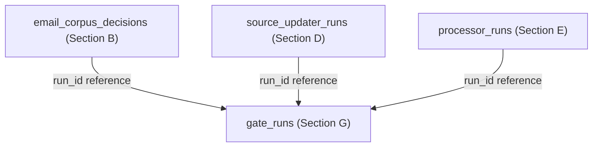

# Section G Execution Plan - Validation Ladder and Rust Execution Standard

## Objective

Define the required path from v2.5 implementation work to safe production completion on Arnold.

This plan exists to prevent v2.5 from moving directly from design to production mutation. Every v2.5 change must graduate through a validation ladder:

```text
synthetic fixtures -> small slice -> larger slice -> local seed dry-run -> local seed staging apply -> Arnold dry-run -> Arnold reviewed apply -> Arnold soak/readiness
```

It also defines the Rust execution standard. v2.5 should use the Rust engine for vault scanning, cache reads, materialization, chunking, and slice/seed validation wherever the existing Rust engine supports the path.

## Non-Goals

- Do not implement the validation harness in this planning pass.
- Do not run Arnold cleanup from this plan.
- Do not require physical vault pruning of the canonical seed or Arnold. Slice vault-remove of suppressed/quarantine mail is required before seed-copy 5b.
- Do not require a new Rust rewrite for v2.5.
- Do not bypass Python code where Rust does not already own the path.
- Do not treat wall-clock speed as a reason to skip correctness gates.
- Do not invent a new report shape, run-id scheme, or review/apply lifecycle where the linker, deploy, staging, and migration patterns already answer the design.

## Existing Code and Docs to Inspect Before Implementation

- `ppa/archive_docs/vision/v2_5_execution_plans/README.md`
- `ppa/archive_docs/vision/v2.5vision.md`
- `ppa/archive_docs/phase_2_9_audit.md`
- `ppa/archive_docs/reports/archive_crate-benchmark-tier2-baseline.json`
- `ppa/archive_crate/`
- `ppa/archive_cli/ppa_engine.py` or equivalent engine selection helpers
- `ppa/archive_cli/schema_ddl.py` for `meta`, `schema_migrations`, `rebuild_checkpoint`, `link_jobs`, `link_decisions`, and related run/decision tables
- `ppa/archive_cli/config.py` for `ArchiveConfig` fields that identify an archive instance
- `ppa/archive_cli/vault_cache.py`
- `ppa/archive_cli/materializer.py`
- `ppa/archive_cli/loader.py`
- `ppa/archive_cli/commands/deploy.py` for `DeployStep` / `DeployResult` report shape and deployment preflight sequencing
- `ppa/archive_cli/commands/staging.py` for validation report counts, warnings, and seed snapshot naming
- `ppa/archive_cli/commands/preflight.py` for existing preflight check style
- `ppa/archive_cli/commands/maintain.py` for maintenance watermarks stored in `meta`
- `ppa/archive_tests/`
- `ppa/archive_scripts/`
- `ppa/archive_docs/vision/v2_5_execution_plans/section_b_current_arnold_cleanup.plan.md`
- `ppa/archive_docs/vision/v2_5_execution_plans/section_f_arnold_observability_v3_gate.plan.md`

## Closed Design Decisions - Prior-Art Bindings

Section G should close the shared control-plane decisions by generalizing existing production patterns in the codebase. A future implementation agent should not invent a new run model, report shape, review flow, or instance identity scheme when a local pattern already exists.

### 1. Gate Evidence Ledger

**Decision:** Section G owns a durable `gate_runs` ledger that records gate evidence for every v2.5 long operation and reviewed apply path.

**Existing pattern:** Use `schema_migrations` for versioned, applied-at evidence; `link_jobs` for status, version, input hash, timestamps, and error state; and `meta(key, value)` for compact watermarks consumed by maintenance/status surfaces.

**Binding:** Implement `gate_runs` as the parent run table for v2.5 gate evidence. It should be queryable by `run_id`, `gate`, `archive_instance`, `status`, and `reviewed`/`approved` state. `ppa status` and Section F readiness should read this ledger, not scrape report files, when deciding whether prior gates have passed.

### 2. Archive Instance Identity

**Decision:** Reports and refusal guards use one canonical archive instance label.

**Existing pattern:** `ArchiveConfig` already resolves the instance-defining inputs: `vault_path`, `index_dsn`, and `index_schema`. Staging already names seed snapshots with stable labels such as `hf-archives-seed-20260307-235127`.

Section G should define an instance identity helper that derives a stable label from `index_schema`, a safe DSN fingerprint or host/schema descriptor, and `vault_path`. Production apply guards must key off `PPA_ARCHIVE_INSTANCE_ROLE=production` (or a `production:` label prefix) so they can distinguish fixture, slice, seed staging, production dry-run, and production reviewed apply.

### 3. Run ID and Decision Ownership

**Decision:** Section G issues and tracks generic v2.5 `run_id` values; section-specific tables own their domain decisions.

**Existing pattern:** The linker lifecycle separates jobs, candidates, decisions, review, and promotion: `link_jobs` owns the durable job/run state, while `link_decisions` owns policy decisions for candidates.

**Binding:** `gate_runs.run_id` is the parent identifier. Section B's `email_corpus_decisions.decision_run_id`, Section D's `source_updater_runs.run_id`, and Section E's `processor_runs.run_id` should reference or mirror that parent run. G owns the run registry and gate state; each section owns its domain-specific decision rows.



### 4. Refusal Guard Utility

**Decision:** Unsafe work is refused by a shared guard utility that returns standard exit code `3`.

**Existing pattern:** Phase 9 deployment already sequences preflight, migration, rebuild, verification, and restart steps before production work. Existing dry-run/apply toggles, such as seed-link promotion controls, keep mutation separate from candidate generation.

**Binding:** Section G should ship reusable guard functions for "requires prior gate evidence," "requires reviewed decision run," "requires Arnold instance confirmation," and "requires explicit expensive-work opt-in." These guards must be testable before Section B exists by exercising them through a small fake or sample command.

### 5. Report Schema

**Decision:** Section G owns the base v2.5 report shape.

**Existing pattern:** `DeployStep` / `DeployResult` use dataclasses, status literals, elapsed timings, details dictionaries, and `to_dict()` serialization. `StagingReport` adds the counts, warnings, and status shape expected from validation reports.

**Binding:** Implement the v2.5 report as a dataclass-backed schema with `to_dict()` JSON output, a human summary writer, and a golden fixture. Later sections should extend that schema with section-specific summaries rather than creating separate report formats.

## Agent Handoff Checklist

Before implementation:

- Read `README.md`, `v2.5vision.md`, and this plan before any other v2.5 implementation work.
- Implement the report/gate vocabulary before Section B or Arnold apply code exists.
- Make command refusal rules testable.
- Make engine-mode reporting mandatory for long corpus jobs.

Likely implementation files:

- shared report/gate module modeled on `DeployStep` / `DeployResult` and `StagingReport`.
- gate-run registry or schema helper modeled on `schema_migrations`, `meta`, and `link_jobs`.
- archive-instance identity helper backed by `ArchiveConfig.vault_path`, `ArchiveConfig.index_dsn`, and `ArchiveConfig.index_schema`.
- CLI guard utilities that return exit code `3` for unsafe-operation refusal.
- test helpers for fixture/slice/seed/Arnold gate metadata and fake-command refusal checks.
- status/readiness module consumed by Section F.

Required first tests:

- Arnold apply is refused without reviewed Arnold dry-run decision run.
- refusal utilities return standard exit code `3`, not runtime failure code `1`.
- report includes ladder gate and engine mode.
- report serialization follows the shared dataclass/`to_dict()` shape.
- archive instance identity is stable for fixed vault/schema/DSN inputs and distinct across fixture, seed staging, and Arnold labels.
- readiness fails if required prior gate evidence is missing.
- readiness checks gate evidence from the durable gate ledger rather than report-file scraping.
- full reclassification/embedding/linker flags are opt-in.

Stop conditions:

- an implementation path can mutate Arnold without Section G evidence.
- reports cannot distinguish fixture/slice/seed/Arnold runs.
- long-running jobs do not emit JSON reports.
- Python fallback hides Rust/Python divergence.

## Core Rule

No v2.5 apply path may run against Arnold until the same operation has passed:

1. synthetic tests.
2. real slice dry-run.
3. real slice apply/rollback.
4. larger slice apply/rollback.
5. local seed dry-run.
6. local seed staging apply/rollback.
7. Arnold dry-run with reviewed report.

- Arnold is the final production target, not the first place the workflow proves itself. Set `PPA_ARCHIVE_INSTANCE_ROLE=production` on the live archive host.

## Validation Ladder

### Gate 0: Documentation Readiness

Purpose:

- Confirm the implementation plan is specific before code changes begin.

Required evidence:

- Section A-G execution plans are present.
- Each plan names objective, non-goals, data model choices, CLI behavior, rollout, tests, rollback, reporting, and definition of done.
- Open design questions are resolved or explicitly marked as blockers.

Exit criteria:

- v2.5 implementation work can begin.

### Gate 1: Synthetic Fixtures

Purpose:

- Validate policy and processor behavior without production data volume.

Required coverage:

- `EmailPromotionPolicy` examples from Section A.
- classification precedence from Section B.
- Gmail promotion/suppression/quarantine outcomes from Section C.
- source updater batch accounting from Section D.
- processor staleness/version/corpus-state rules from Section E.
- status/readiness calculations from Section F.

Exit criteria:

- Unit tests pass.
- No real vault mutation.
- No LLM calls unless an explicit test fixture stubs them.

### Gate 2: Small Real Slice

Purpose:

- Prove behavior against real vault data with bounded blast radius.

Requirements:

- Use a real slice that includes marketing, transactional, personal, attachment, derived-card, and unknown-classification examples.
- Run corpus-hygiene dry-run.
- Review sample buckets.
- Apply only to the slice or slice schema.
- Roll back.
- Rebuild slice and verify suppressed records do not reappear as active.

Exit criteria:

- dry-run deterministic.
- apply/rollback works.
- rebuild safety passes.
- suppressed email absent from default retrieval, vector retrieval, enrichment queue, and link candidates.

### Gate 3: Larger Real Slice

Purpose:

- Surface runtime and scale issues before seed.

Requirements:

- Use a larger slice than Gate 2.
- Run with progress logging and JSON reports.
- Capture wall-time and throughput for scan, decision generation, apply, rebuild validation, embedding filtering, and linker filtering.
- Confirm new LLM calls are limited to missing/stale classification.

Exit criteria:

- Runtime is bounded and explainable.
- Report sizes are manageable.
- No full reclassification.
- No full embedding/link reruns except explicitly requested validation jobs.

### Gate 4: Local Seed Dry-Run

Purpose:

- Evaluate the complete current seed corpus without mutation.

Requirements:

- Read the seed locally.
- Generate dry-run decisions and reports.
- Use existing classification stores first.
- Produce classification coverage, suppression counts, quarantine counts, derived-card impact, and estimated index impact.
- Do not apply.

Exit criteria:

- Operator reviews dry-run report.
- Classification reuse rate meets expectation.
- New LLM call count is understood and acceptable.
- No unexpected high-risk buckets.

### Gate 5: Local Seed Staging Apply

Purpose:

- Prove apply and rollback at seed scale without touching the canonical seed or Arnold.

Requirements:

- Use a copied vault, staging schema, or staging corpus state store.
- Apply a reviewed decision run.
- Validate search/hybrid/vector/linker suppression behavior.
- Validate derived-card preservation.
- Run incremental rebuild validation.
- Run full rebuild validation if the implementation touches materialization or corpus-state projection.
- Roll back and verify prior active state.

Exit criteria:

- staging apply passes.
- rollback passes.
- rebuild safety passes.
- no canonical seed mutation.

### Gate 6: Arnold Dry-Run

Purpose:

- Evaluate production state without mutation.

Requirements:

- Run dry-run only.
- Produce human and JSON reports.
- Record Arnold source cursors, schema, classification stores, and decision run ID.
- Review samples for high-confidence suppressions, quarantines, active overrides, derived-card impacts, and unknown classifications.

Exit criteria:

- dry-run reviewed.
- apply candidate approved.
- rollback point identified.
- no production mutation has occurred.

### Gate 7: Arnold Reviewed Apply

Purpose:

- Apply the reviewed corpus-state changes to Arnold safely.

Requirements:

- Apply only a dry-run decision run generated on Arnold.
- Revalidate that source cursors and major counts did not drift unexpectedly.
- Persist decision records before any active-state changes.
- Apply DB-first / status-store-first.
- Do not delete vault markdown.
- Write apply report.
- Run post-apply retrieval, embedding, enrichment, linker, and rebuild-safety checks.

Exit criteria:

- apply succeeds.
- suppressed email absent from default surfaces.
- derived cards preserved.
- rollback remains available.

### Gate 8: Arnold Soak and v3 Readiness

Purpose:

- Prove Arnold stays healthy through normal maintenance.

Requirements:

- Run normal maintenance cycles.
- Verify future Gmail sync uses classify-before-promotion.
- Verify source freshness status.
- Verify processor backlog and failures.
- Verify suppressed email does not return after rebuild or maintenance.
- Verify v3 readiness gate from Section F.

Exit criteria:

- Arnold status reports ready for v3.
- failures, if any, are documented and resolved.

## Rust Execution Standard

v2.5 should default to the Rust engine for hot paths already validated in Phase 2.9.

Required standards:

- Use `PPA_ENGINE=rust` for slice, seed, and Arnold validation unless explicitly testing Python parity.
- Use Rust vault cache for census and type-filtered scans where possible.
- Use Rust materialization/chunking paths for rebuild-safety validation.
- Avoid Python full-vault walks for corpus hygiene unless debugging parity or unsupported edge cases.
- Treat Rust/Python divergence as a blocking validation issue before Arnold apply.
- Capture engine mode in every dry-run/apply/report.

Rust-owned or Rust-accelerated paths to prefer:

- vault walking and cache build.
- frontmatter parsing / content hashing where already wired.
- type-filtered note scans from vault cache.
- materializer row batch path.
- chunk building and chunk hashing.
- person index / resolution paths where applicable.

Python remains appropriate for:

- adapter orchestration.
- Gmail/Calendar/iMessage/Photos provider logic.
- policy glue until a Rust rewrite is justified.
- LLM classification/extraction calls.
- CLI/report formatting.

## Long Wall-Time Guardrails

Every v2.5 execution plan should respect these guardrails:

- Never classify all email by default.
- Never embed all chunks by default.
- Never run all linkers by default.
- Never apply to Arnold without reviewed dry-run.
- Prefer metadata, classification stores, and indexed projections over full vault walks.
- Use count/sample modes before full reports.
- Checkpoint long-running dry-runs and applies.
- Emit progress for scan, classify reuse, decision generation, apply, rebuild validation, embedding filtering, and linker filtering.
- Write JSON reports for every long operation.
- Include throughput and elapsed runtime in reports.

## Seed and Arnold Safety Rules

Seed safety:

- The canonical seed is never the first apply target.
- Local seed apply must use a copied vault, staging schema, or staging corpus-state store.
- Rollback must be validated on staging before any production apply.

Arnold safety:

- Arnold dry-run precedes Arnold apply.
- Arnold apply uses a decision run generated on Arnold.
- Arnold apply is DB-first and non-destructive.
- Arnold apply never prunes markdown in v2.5.
- Arnold rollback remains available after apply.
- Arnold readiness requires post-apply soak.

## Required Report Fields

Every ladder run should include:

- ladder gate name.
- archive instance: fixture, slice, larger slice, seed staging, Arnold dry-run, Arnold apply.
- engine mode: `rust`, `python`, or parity.
- vault path and schema.
- decision run ID.
- policy version.
- classification source counts.
- new LLM call count.
- active/suppressed/quarantine counts.
- dirty processor count.
- embedding/linker affected counts.
- elapsed runtime and throughput by phase.
- warnings/errors.
- next gate recommendation.

The implementation should realize this field list as a shared dataclass-backed report shape following the `DeployStep` / `DeployResult` pattern: status literals, elapsed timings, details dictionaries, and `to_dict()` JSON serialization. `archive_instance` must come from the Section G instance-identity helper. `run_id` / `decision_run_id` must be issued or validated by the gate-run registry, not invented independently by each section.

## Tests and Validation

Future implementation should add tests or scripts that prove:

- Gate 1 synthetic fixtures pass without real vault access.
- Gate 2 slice apply/rollback passes.
- Gate 3 larger slice produces bounded reports and no full reclassification.
- Gate 5 seed staging apply does not mutate canonical seed.
- Rust engine mode is recorded in reports.
- Unsupported Python fallbacks are visible.
- Arnold readiness cannot pass unless prior gates are recorded.
- instance identity detection distinguishes Arnold apply from fixture, slice, and staging runs.
- refusal guards can be exercised through a fake/sample command before Section B apply code exists.
- gate evidence is recorded in the `gate_runs` pattern and Section F-style readiness fails closed when rows are missing, failed, unreviewed, or from the wrong archive instance.
- reports round-trip through the shared dataclass/`to_dict()` JSON shape and include artifact paths that `ppa status` can locate.

## Definition of Done

Section G implementation is ready when:

- The validation ladder is encoded in docs, scripts, or status checks.
- v2.5 apply commands refuse Arnold apply without a reviewed Arnold dry-run decision run.
- Reports include ladder gate and engine mode.
- Slice and seed staging apply/rollback are proven before Arnold apply.
- Rust engine is the default for supported scan/cache/materialization/chunking validation paths.
- Wall-time guardrails prevent accidental full reclassification, embedding, or linker reruns.
- Arnold readiness depends on passing the ladder and the Section F gate.
- Standard exit codes distinguish success, runtime failure, validation failure, unsafe-operation refusal, and external dependency blockage.
- Required artifact paths are stable enough for `ppa status` and future agents to locate reports.
- Gate evidence is durable in a `gate_runs`-style registry modeled on `schema_migrations`, `meta`, and `link_jobs`.
- Archive instance identity is canonical and derived from `ArchiveConfig` inputs so Arnold-specific guards are reliable.
- Section-specific decision tables can reference Section G `run_id` values without redefining run ownership.
- Reusable refusal guards enforce reviewed decision runs, Arnold confirmation, prior gate evidence, and explicit expensive-work opt-ins with exit code `3`.
- The shared report schema follows the existing deploy/staging dataclass pattern and includes a golden report fixture.

## Completion Artifacts

The implementation agent must leave:

- validation ladder state/report schema.
- command refusal tests.
- report artifact directory convention.
- engine-mode reporting test.
- Arnold apply refusal test without reviewed Arnold dry-run.
- full reclassification/full embedding/all-linker opt-in tests.
- readiness fixture showing missing gate evidence fails closed.

## Commit Instructions

Commit this section by itself.

- Start only from a clean tree.
- Stage only Section G implementation, tests, docs, and artifacts.
- Commit subject: `v2.5 section G: validation ladder rust standard`
- Commit body must follow the shared pattern in `README.md`.
- After commit, `git status --short` must be clean before Section A work starts.
